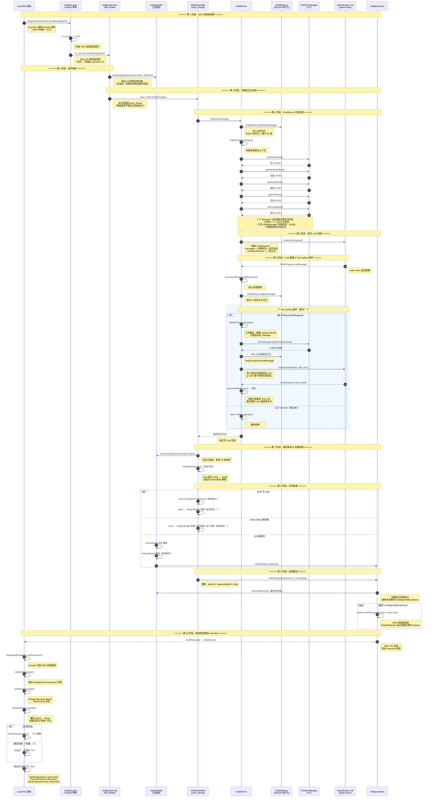

# sendMessage(text) 完整处理流程 — UML 时序图

---

## 流程说明

### 整体阶段划分

| 阶段 | 步骤（编号） | 线程/进程 | 说明 |
|------|------------|----------|------|
| AIDL 跨进程调用 | ①-③ | Launcher 进程 → AIAgent 进程 | Launcher 通过 AIAgentSdk.jar 的 Facade 调用 AIDL 接口，跨进程到 AIAgentService |
| 超时保护 | ④ | 主线程 | 启动 15 秒定时器，到期自动返回"系统: 请求超时" |
| 后台线程分发 | ⑤ | work_thread | AIDL Binder 线程把任务投递到后台 HandlerThread |
| ChatServer 处理 | ⑥-⑨ | work_thread | 写入对话历史 + 采集车辆状态 + 构建 LLM 请求 |
| 首次 LLM 调用 | ⑩ | work_thread | 调用 DashScope qwen-turbo，传入消息 + 工具定义 |
| Tool Calling 递归 | ⑪-⑳ | work_thread | LLM 可能要求调用工具，执行后结果送回 LLM 再推理 |
| 结果封装与异常处理 | ㉑-㉖ | work_thread / 主线程 | 取消超时 + 封装 AIAgentData + 处理各类异常 |
| 回调推送 | ㉗-㉚ | 主线程 | 遍历注册的 AIDL 回调监听器，跨进程推回 Launcher |
| Launcher 接收 | ㉛-㉟ | Launcher 进程 | Facade 桥接 AIDL 回调 → IAIAgentServiceListener → handleAIResponse → UI 更新 + TTS |

### 关键设计点

**15 秒超时**：`mainHandler.postDelayed(timeoutRunnable, 15000)`。若 ChatServer 在 15 秒内未返回，自动通过 `notifyAIAgentListeners` 推送"系统: 请求超时"。若正常返回，通过 `removeCallbacks` 取消定时器。

**双重线程安全**：
- ChatServer 调用在 `mWorkHandler`（`work_thread`）上执行，不阻塞主线程
- 回调推送通过 `mainHandler.post {}` 回到主线程，避免并发修改监听器列表

**Tool Calling 递归**：LangChain4j 的模型调用返回后，`processAiResponse()` 检测是否有 `ToolExecutionRequest`。如果有，执行工具 → 写入对话记忆 → 再次调用模型 → 递归直到 LLM 返回纯文本。每次递归都可能产生新的 Tool Call。

**三级异常处理**：
| 层 | 捕获目标 | 结果 |
|----|---------|------|
| chat == null | 提前检查抛出 | "系统: 请求失败 - ChatServer 未初始化" |
| sendMessage try-catch | chat.chat() 异常 | "系统: 请求失败 - <异常信息>" |
| 15 秒超时 | 异步定时器 | "系统: 请求超时" |

### 关键类索引

| 步骤 | 类 | 方法 | 文件路径 |
|------|-----|------|---------|
| ① | `AIAgent` | `sendMessage()` | `app/.../AIAgent.java:112` |
| ③ | `AIAgentBinder` | `sendMessage()` | `app/.../AIAgentService.kt:477` |
| ⑥ | `ChatServer` | `chat()` | `ChatServer/.../ChatServer.java:203` |
| ⑦ | `` | `chatWithVehicleStatus()` | `ChatServer/.../ChatServer.java:173` |
| ⑨ | `` | `getVehicleStatus()` | `ChatServer/.../ChatServer.java:184` |
| ⑪ | `` | `processAiResponse()` | `ChatServer/.../ChatServer.java:152` |
| ⑫ | `` | `handleTools()` | `ChatServer/.../ChatServer.java:134` |
| ㉕ | `AIAgentService` | `notifyAIAgentListeners()` | `app/.../AIAgentService.kt:569` |
| ㉛ | `AIAgent.AIAgentAidlCallback` | `onAIResponse()` | `app/.../AIAgent.java:253` |
| ㉟ | `MainActivity` | `onAIResponse()` → `handleAIResponse()` | `Launcher/.../MainActivity.java` |
