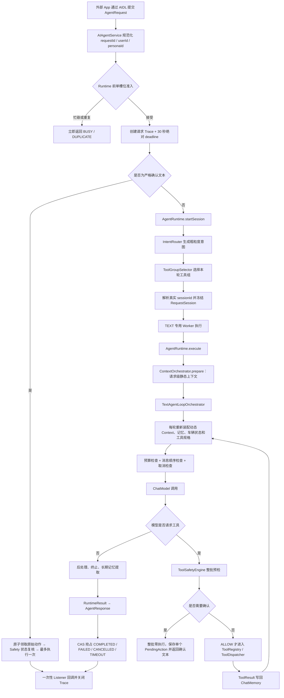
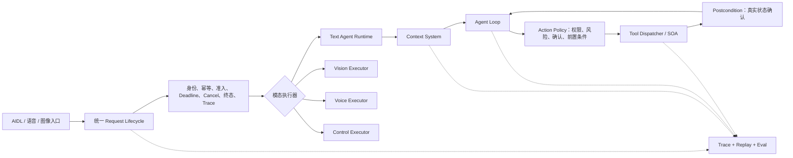

# AIAgent Agent 架构与运行流程评估报告

> 评估日期：2026-07-13  
> 评估对象：当前工作树中的 AIAgent Android 后台引擎  
> 评估重点：Agent 定位、生产运行主链、上下文装配、工具闭环、记忆、取消与超时、安全、可观测性、评测体系  
> 评估边界：本报告不是逐文件代码审计，也不评价具体大模型的回答质量；结论主要针对 **TEXT 生产主链**，并抽查 IMAGE / VOICE / CONTROL 分支与相关基础设施。

> **实施更新（2026-07-13）：** 本报告首次评估指出的三个 P0 已按 `docs/plan/2026-07-13-agent-p0-runtime-tool-safety-improvement-plan.md` 完成实现。原始问题描述保留为历史评估快照，当前状态以本文新增的“P0 实施结果”及 README 为准。

---

## 1. 结论先行

### 1.1 总体判断

AIAgent 的设计方向是正确的，而且已经明显越过了“把 LLM 接到几个 Tool 上”的原型阶段。它目前更准确的架构定位是：

> **以确定性运行时为外壳、以模型驱动工具调用循环为核心、面向车载场景的受控型单 Agent 系统。**

系统不是完全自治型 Agent，也不是固定步骤的普通工作流，而是二者的组合：请求身份、会话解析、Context 采集、工具暴露范围、终态抢占、Trace 和响应分发由代码确定；模型则在每轮 Context 内决定是否调用工具、调用哪个工具以及何时结束。这种“外层确定、内层自治”的混合形态非常适合车载控制场景，比追求更强的自由规划更稳妥。

从架构设计本身看，项目可评为 **8.1 / 10**；从当前生产运行闭环成熟度看，可评为 **7.7 / 10**。若按不同目标衡量：

| 目标阶段 | 结论 | 参考成熟度 |
|---|---|---:|
| Android 车机 Demo、虚拟车辆状态演示 | 主流程已经成立，三个 P0 已闭环，可继续联调和展示 | **8.5 / 10** |
| 稳定的内部试用版本 | 单 Session TEXT 已具备可靠性与安全基础；长上下文恢复和多模态生命周期仍需完善 | **7.7 / 10** |
| 连接真实车辆执行高风险控制 | 当前仍不够，主要差距在调用方鉴权、真实执行回执、物理状态确认、幂等补偿和故障评测 | **6.3 / 10** |

这里的差距并不意味着需要推倒重写。相反，项目已经具备可以继续演进的核心骨架；下一阶段应集中完成“控制平面与安全闭环”，而不是增加更多 Agent、Planner 或抽象层。

### 1.2 最值得肯定的设计

1. `AIAgentService → AgentRuntime → ContextOrchestrator → TextAgentLoopOrchestrator` 已经形成清晰的生产主链，而不是只有模块没有真实接线。
2. Context 已成为 TEXT 模型输入的统一装配入口，Prompt、会话记忆、长期记忆、车辆状态、调用方补充信息和工具规格不再由各处随意拼接。
3. ToolGroup 已经实际决定本轮暴露给模型的 `ToolSpecification`，实现了工具能力面收敛，而不只是记录元数据。
4. Agent 循环具有最大轮数、时间限制、取消检查、安全门、工具回写和终止条件，具备完整 Agent harness 的基本要素。
5. `ActiveRequest` 的 CAS 终态抢占和 `TraceResponseDispatcher` 的一次性响应控制，显著降低成功、失败、取消、超时重复回调的概率。
6. Trace 已覆盖请求、Runtime、Context、模型与工具阶段，架构具备继续建设可回放评测体系的基础。

### 1.3 P0 实施结果

| 原 P0 | 当前结果 | 仍然存在的边界 |
|---|---|---|
| 请求控制不一致 | TEXT 在 Runtime 前原子单槽位准入；统一 30 秒绝对 deadline；cancel / timeout 可取消同步模型 OkHttp Call；执行体退出前不释放槽位 | 当前只覆盖单 Session TEXT；VOICE / IMAGE / scene 尚未统一生命周期 |
| ToolGroup 异常扩大权限 | 增加四种稳定状态；普通聊天空工具；弱车控表达先澄清；null、异常、全量或聚合结果在 Context / LLM 前失败关闭 | KeywordIntentRouter 仍是 Demo 级意图识别，需要行为数据持续校准 |
| 高风险动作缺少确认 | 保留现有 ToolSafetyEngine，增加 REQUIRE_CONFIRMATION、30 秒内存 PendingAction、严格普通 TEXT 确认、确认前状态复核和最多一次执行 | 只覆盖当前两个具体 HIGH Tool；真实 SOA 回执、物理状态确认、鉴权、幂等与补偿仍未完成 |

当前已经达到本轮目标——**真实车辆接入前的本地安全基础**，但不能据此宣称满足真实车辆或量产功能安全要求。

### 1.4 P0 完成后的主要差距

1. **长上下文只有预算拒绝，没有运行时自恢复闭环**：Context 能发现超预算，也预留了压缩能力，但 TEXT 循环没有在超预算后执行“裁剪 / 压缩 / 重装配 / 重试”；固定截取最后 50 条消息还可能截断完整 ToolExchange。
2. **多模态仍存在两代运行路径**：TEXT 使用新 Runtime + Context 主链，VOICE 仍调用 legacy Orchestrator，IMAGE 与 CONTROL 也有独立生命周期，取消、终态、身份、Trace 和错误语义没有完全统一。
3. **真实车控闭环尚未建立**：当前确认后的成功只表示虚拟状态机完成本地调用，不表示真实 ECU 接收、执行或物理状态已经变化。
4. **调用方信任边界仍未完成**：AIDL 未建立量产级调用方鉴权、权限白名单和命令重放防护。
5. **测试更偏工程正确性，缺少 Agent 行为评测**：现有单元测试覆盖很好，但缺少场景数据集、工具轨迹评分、攻击测试、设备故障注入、端侧时延和成本评测。

---

## 2. 评估方法

### 2.1 采用的通用 Agent 评估框架

本报告没有只看“模块数量”或“是否用了某个 Agent 框架”，而是从以下十个维度评价：

| 维度 | 核心问题 |
|---|---|
| 系统定位 | 这是工作流、Agent，还是二者混合？自治边界是否适合业务风险？ |
| 编排与状态机 | 每轮如何开始、推进、调用工具、终止和失败？是否有明确上限？ |
| Context 治理 | 模型看到了什么、为什么能看到、来源是否可信、超预算怎么办？ |
| 工具闭环 | 工具选择、参数、执行、结果回写和错误恢复是否闭合？ |
| 记忆与会话 | 请求、Session、用户、人格是否隔离？长短期记忆是否可控？ |
| 安全与权限 | 是否最小权限、失败收敛、危险动作确认、前后置条件校验？ |
| 可靠性 | 并发、超时、取消、重试、幂等、资源释放和故障降级是否一致？ |
| 可观测性 | 能否解释某次请求为何选择某工具、执行到哪里、为何失败？ |
| Agent 评测 | 是否同时评价最终结果、工具轨迹、环境状态变化、安全和成本？ |
| 可维护性 | 模块边界是否真实、框架依赖是否合理、能否低成本替换组件？ |

这与当前主流 Agent 工程方法基本一致：Anthropic 将固定代码路径的 workflow 与由模型动态决定工具使用过程的 agent 区分开，并建议从最简单、可组合的模式开始；其 Agent 评测方法同时关注多轮交互、工具调用、轨迹与环境状态，而不只比较最终文本。NIST 对 Agent 系统的建议也强调工具使用可见性、运行中探针和事后审计能力。参考资料：

- [Anthropic：Building effective agents](https://www.anthropic.com/engineering/building-effective-agents)
- [Anthropic：Demystifying evals for AI agents](https://www.anthropic.com/engineering/demystifying-evals-for-ai-agents)
- [NIST：Building Evaluation Probes into Agentic AI](https://www.nist.gov/programs-projects/building-evaluation-probes-agentic-ai)

### 2.2 关于 LangChain4j 的评价口径

本项目使用了 LangChain4j 的 `ChatModel`、`ChatMessage`、`ChatMemory`、`ToolSpecification`、`ToolExecutionRequest` 与 `@Tool` 等底层能力，但运行编排由自研 `AgentRuntime`、Context 系统和 AgentLoop 控制。因此应该明确区分：

- 项目**使用了 LangChain4j API 与模型/工具/记忆基础能力**；
- 项目**不是由 LangChain4j AI Services 完整编排的 Agent**。

这不是缺陷。LangChain4j 官方也将低层组件定位为更灵活但需要更多编排代码，将 AI Services 定位为减少常见交互样板的高层抽象。车载系统需要明确的请求状态、安全门、Trace 与控制边界，自研运行外壳是合理选择；没有必要为了“更像框架项目”而迁移掉核心自研模块。参考：

- [LangChain4j：AI Services](https://docs.langchain4j.dev/tutorials/ai-services/)
- [LangChain4j：Tools](https://docs.langchain4j.dev/tutorials/tools/)
- [LangChain4j：Chat Memory](https://docs.langchain4j.dev/tutorials/chat-memory/)

---

## 3. 当前生产运行流程还原

### 3.1 TEXT 主链



### 3.2 这条链路为什么已经是“真正的 Agent”

Agent 的关键不在于类名，而在于模型是否能根据环境反馈动态选择下一步行动。当前 TEXT 循环中，模型每轮接收新的 Context，可以生成一个或多个 ToolExecutionRequest；工具结果写回会话后，下一轮模型再决定继续调用工具或直接回答，并由最大轮数、超时、终止器和安全否决共同限制。因此它属于受控的、反应式工具 Agent。

不过它目前没有独立的任务分解 Planner、显式计划状态或跨任务调度器。它适合“自然语言理解 → 一到数步车控 / 查询 → 回答”的座舱任务，但不应被描述为具备复杂长期规划能力的通用自主 Agent。这种克制反而符合当前业务阶段。

### 3.3 非 TEXT 路径

`AIAgentService.processAgentRequest()` 在入口按 TEXT / IMAGE / VOICE / CONTROL 分流：

- TEXT 进入 `AgentRuntime + ContextOrchestrator + TextAgentLoopOrchestrator`；
- VOICE 仍直接调用 legacy `chatOrchestrator.execute()`；
- IMAGE 直接调用 `VlManager` 并维护独立超时响应；
- CONTROL 主要处理监听、停止与清理记忆等控制命令。

这说明当前“新 Agent 架构”已经在 TEXT 主链落地，但还不是整个 Service 的统一控制平面。后续应统一请求生命周期，不必强行统一不同模态的模型实现。

---

## 4. 分项评分

> 评分评价的是当前代码中已经接入生产路径的设计，不把规划文档中尚未接线的能力计算为完成。

| 维度 | 评分 | 评价 |
|---|---:|---|
| 系统定位与自治边界 | 8.5 / 10 | 确定性外壳约束模型自治，适合车载；没有盲目追求多 Agent 或完全自治 |
| 分层与运行编排 | 8.0 / 10 | Service、Runtime、Context、Loop、Tool、Memory 边界清楚；非 TEXT 尚未统一 |
| Context 治理 | 8.5 / 10 | 来源、信任级别、可见性、生命周期、预算和消息顺序都有结构化表达 |
| 工具选择与执行闭环 | 8.2 / 10 | ToolGroup 已真实收敛模型可见工具，并对异常、全量和聚合选择失败关闭；规则路由仍需行为数据校准 |
| 会话与记忆 | 7.0 / 10 | 多用户/Session/Persona 主键与 SQLite 持久化较完整；长上下文恢复和 ToolExchange 原子性不足 |
| 可靠性与请求控制 | 7.8 / 10 | TEXT 已具备 Runtime 前单槽位准入、30 秒绝对 deadline、终态抢占与底层 HTTP 取消；非 TEXT 尚未统一 |
| 安全与人类控制 | 7.2 / 10 | ToolSafetyEngine 已具备 HIGH 规则失败关闭、文本确认与确认前状态复核；真实 SOA 回执、鉴权和补偿仍未完成 |
| Trace 与可解释性 | 8.0 / 10 | 主阶段可追踪且有脱敏设计；个别成功/失败归因仍可能失真 |
| 测试与 Agent 行为评测 | 6.0 / 10 | 单元/集成测试数量可观，但缺少场景级、轨迹级、设备级与对抗评测 |
| 可维护性与演进空间 | 7.5 / 10 | 自研边界合理、组件可替换；测试构造器、legacy 路径和部分重复生命周期增加复杂度 |

综合判断：**架构骨架良好，Context、TEXT 请求控制和本地安全闭环已经较完整；当前主要短板转向真实车辆执行闭环、多模态统一和 Agent 行为评测。**

---

## 5. 设计优势详评

### 5.1 Runtime 是真正的边界层，而不是又一个“大总管”

`AgentRuntime` 负责路由意图、选择工具组、解析 Session、构造不可变 `RequestSession`、准备 Context 并把结果映射为 `RuntimeResult`；Service 仍拥有 Binder、Listener、超时调度和 TraceSession 生命周期。这种职责切分整体合理，Runtime 可在 JVM 测试中独立验证，也没有直接吞并 Android IPC 细节。

`RequestSessionFactory` 还会让规范化后的 requestId、userId、sessionId、personaId 和 clientMessageId 覆盖调用方 extra 中的同名信息，避免调用方通过扩展字段伪造核心身份。这是一个很好的信任边界设计。

### 5.2 Context 已经成为模型输入治理系统

当前 Context 不只是 Prompt 拼接器，而是完成了以下职责：

- 区分请求级静态信息与迭代级动态信息；
- 聚合 Persona Prompt、调用方信息、短期记忆、长期记忆、车辆状态、时间和工具规格；
- 标记来源、信任级别、模型可见性、优先级和生命周期；
- 形成统一消息序列并验证 ToolExchange 顺序；
- 估算 Token、保留输出预算并拒绝超窗请求；
- 将调试信息和 Trace 与最终 Context 对齐。

这是当前项目最有价值的自研边界之一。它把“模型能看到什么”从各业务模块中抽出来，使安全、压缩、审计和多模型适配都有统一落点。

### 5.3 工具能力暴露已经从“全量注册”进化为“按请求选择”

`IntentRouter → ToolGroupSelector → ToolGroupContextProvider → ToolSpecification` 已经进入真实 ChatRequest。换言之，ToolGroup 不再只是观察元信息，而是决定模型本轮可调用的能力集合。这同时改善：

- 提示词 Token 消耗；
- 模型在大量相似车控工具中的选择准确性；
- 工具权限面；
- Trace 对“为什么暴露这些工具”的解释能力。

当前 Keyword/规则路由并不高级，但对 47 个边界明确的车控工具而言，确定性选择比再增加一个路由 LLM 更容易控制。后续应先用场景评测证明规则瓶颈，再决定是否升级路由策略。

### 5.4 Agent 循环具有明确停止条件

TEXT 配置包含最大 10 次迭代，并与 Service、Runtime、模型 HTTP 调用共享 30 秒绝对 deadline；循环内还有取消检查、预算门、ToolSafetyEngine 批次预检与文本确认、PostProcessor 和 Terminator。这符合 Agent 工程中“必须限制迭代、时间和工具行为”的基本原则，避免把退出完全交给模型。

### 5.5 终态抢占设计正确

`ActiveRequest` 用原子状态在 COMPLETED、CANCELLED、TIMEOUT、FAILED 等终态之间竞争，`TraceResponseDispatcher` 再限制同一请求只发送一次响应。这是当前可靠性设计中的亮点：即使 Service 超时线程、执行线程和取消 Binder 同时到达，也有明确的唯一赢家。

### 5.6 可观测性基础较强

项目已经具备请求级 Trace、Runtime/Context 子阶段、模型调用、工具阶段诊断、HTTP 拦截器、脱敏和 Phoenix 调试路径。这意味着下一阶段可以基于真实 Trace 建立失败聚类、轨迹回放和离线评分，而无需重新埋一套观测系统。

---

## 6. 关键问题与风险分级

### 6.1 P0（已完成）：TEXT 请求时限与单槽位语义

- Service 在 Runtime 前原子准入；第二个 TEXT 请求立即返回 BUSY，不进入 Router、Context 或执行队列。
- `RequestDeadline` 从准入时起提供统一 30 秒绝对期限，贯穿 Runtime、Context、AgentLoop 与模型 adapter。
- `RequestCallRegistry` 登记同步 OkHttp Call；cancel / timeout 会调用 `Call.cancel()`，并处理先取消后登记竞态。
- cancel、timeout、success 和 failure 继续通过 CAS 竞争唯一终态；旧执行体真正退出前不释放槽位。
- requestId 活跃重复和 60 秒完成缓存内重复都会被拒绝，不覆盖原请求。

当前边界是只按已确认范围处理单 Session TEXT；clientMessageId 业务幂等与非 TEXT 生命周期统一仍属后续工作。

### 6.2 P0（已完成）：ToolGroup 失败关闭

- 选择结果使用 `SELECTED / CHAT_ONLY / CLARIFICATION_REQUIRED / FAILED_CLOSED` 稳定状态。
- 普通 CHAT / UNKNOWN 只得到空工具；弱车控表达返回固定澄清文本，不调用模型。
- Selector null、异常、全量或聚合结果在 Context 与 LLM 前失败关闭。
- Context 只有在 SELECTED 状态下解析选中 ToolSpecification，不自行扩权。

### 6.3 P0（已完成）：ToolSafetyEngine 文本二次确认基础

- 保留统一 `ToolSafetyEngine`，增加 `REQUIRE_CONFIRMATION` 与 `CONFIRMED_RECHECK`，没有恢复旧 Guard 或引入第二个 Safety 系统。
- 当前具体 HIGH Tool `set_door_lock` 和 `set_chassis_mode` 缺少专用规则时以 `POLICY_NOT_CONFIGURED` 失败关闭。
- 静止解锁或切换底盘模式首轮不执行；单个原始 Tool 与规范化参数保存在 30 秒内存 PendingAction 中。
- 下一条普通 TEXT 只接受“确认执行”或“取消执行”；确认时重新读取车辆状态并最多 dispatch 一次。
- 过期、取消、状态变化、重复、并发确认和多 Tool 确认批次均不会造成重复或部分执行；非 TEXT 路径不把确认要求当作 ALLOW。

仍未完成的真实车辆边界包括状态来源可信性、调用方权限、SOA 回执、执行后物理状态确认、命令幂等和失败补偿。

### 6.4 P1：长上下文缺少自动恢复闭环

ContextBudgetManager 可以输出预算决策，Memory 侧也已有压缩相关接口和实现，但 TEXT 循环在 Context 超预算时主要返回失败，没有执行“压缩后重新装配”。这会造成一个典型现象：系统知道为什么放不下，却不能自动解决。

另一个细节是 `sessionMemorySnapshot()` 直接取最后 50 条 `ChatMessage`。工具调用通常由 AI tool request 与对应 ToolResult 构成不可分割的交换；按消息数量直接截断可能从中间切开，随后被消息顺序校验器拒绝。LangChain4j 的 Chat Memory 文档也特别说明了工具消息清理需要避免留下孤立 ToolResult。

**建议形成固定恢复顺序：**

1. 先丢弃低优先级、可重建的动态 Context；
2. 以完整对话 Turn / ToolExchange 为单位裁剪短期窗口；
3. 执行记忆压缩并持久化摘要；
4. 重新装配并重新计算预算；
5. 仍超限时才向 Runtime 返回明确的 `CONTEXT_BUDGET_EXCEEDED`。

### 6.5 P1：TEXT 与其他模态的请求控制面分裂

TEXT 已经拥有 RequestSession、Context、CAS 终态、RuntimeResult 和统一响应映射；VOICE、IMAGE、CONTROL 各自维护执行与回调逻辑。问题不是它们用了不同模型，而是身份、取消、超时、Trace、错误码和响应唯一性没有共享同一套生命周期协议。

建议抽取的是“统一 Request Lifecycle”，而不是把所有模态塞进 TextAgentLoop：

```text
统一入口与身份快照
    → 统一 admission / deadline / cancel / terminal-state / trace
    → 按模态选择 TextExecutor / VisionExecutor / VoiceExecutor / ControlExecutor
    → 统一 RuntimeResult 与响应分发
```

### 6.6 P1：错误、工具结果与记忆事务语义还不够精确

当前工具执行失败通常被编码成中文字符串再作为 ToolResult 回写，模型可以继续修正，这对 Agent 自恢复有帮助；但系统层较难准确区分参数错误、工具不存在、车辆拒绝、通信失败、超时和部分成功。部分 Trace 也可能把“Dispatcher 正常返回了失败字符串”记录为调用成功。

此外，TEXT 循环在模型调用前提交当前用户消息；如果模型调用随后失败，会话中可能留下只有 UserMessage 的未完成 Turn。模型回复会先写入 ChatMemory，再经 PostProcessor 生成最终用户可见文本，因此记忆中的原始文本也可能与实际响应不同。这些行为不一定错误，但必须显式定义：

- 失败 Turn 是否保留，下一次请求如何识别；
- 重试是否复用同一 clientMessageId；
- 记忆保存原始模型输出、最终输出，还是两者都保存；
- 工具结果采用怎样的结构化状态与错误码。

### 6.7 P1：缺少真正的 Agent 行为评测体系

当前 `app/src/test` 有 66 个测试源文件，最近一次完整 `testDebugUnitTest` 记录 339 个测试、0 failure、0 error；Runtime、Context、ToolGroup、Memory、Trace、Safety 和 AgentLoop 均有较多 JVM 测试。这说明工程可测试性较好。

但目前只发现 1 个示例性质的 instrumented test，没有发现成体系的 scenario / golden / trajectory / benchmark 测试资产。单元测试能证明某个组件按代码预期运行，不能证明 Agent 在真实任务中选对工具、用对参数、达到正确车辆状态、没有越权，并满足时延要求。

建议建立四层评测：

| 层级 | 主要评分对象 | 示例 |
|---|---|---|
| L1 组件契约 | Router、Context、Budget、Dispatcher、Memory | 输入固定，输出与错误码确定 |
| L2 轨迹评测 | 工具名、参数、顺序、轮数、终止原因 | “打开副驾车窗一半”只调用正确窗口工具一次 |
| L3 状态结果 | 虚拟/真实环境最终状态 | 执行后 WindowState 为目标值，其他车窗不变 |
| L4 系统与安全 | 并发、取消、超时、Prompt Injection、权限、设备时延 | 超时不落地动作；恶意文本不能扩大工具权限 |

每个场景至少记录：最终回答、工具轨迹、最终环境状态、安全否决、Token、模型调用次数、总时延、排队时延和重试次数。评测器应组合确定性断言、状态机断言、规则评分与必要的 LLM-as-judge，而不是只用一个语言模型给最终回答打分。

### 6.8 P2：维护性债务

- `AgentRuntime` 为测试保留了较多构造器和默认匿名依赖，降低了主构造路径的清晰度；
- TEXT 新链与 legacy AgentLoop 并存，使 Service 初始化和错误处理较复杂；
- 部分异常被统一映射为 MODEL_CALL_FAILED，不能准确定位是模型、记忆、Context、工具还是后处理阶段；
- 全局单 `TextAgentLoopOrchestrator` 自带运行状态，未来如改为并发执行，需要先明确实例作用域。

这些不应抢在 P0/P1 前大规模重构。等请求控制与行为契约稳定后，再做一次小范围收敛更合适。

---

## 7. 按运行阶段评价

| 阶段 | 当前设计 | 评价 | 主要改进 |
|---|---|---|---|
| AIDL 接入 | 统一 AgentRequest；TEXT 在 Runtime 前单槽位准入并防重复 requestId | 良好 | 增加量产调用方鉴权 |
| Runtime 建会话 | 路由意图、选工具组、解析 session、冻结请求快照 | 良好 | 选择异常应收敛到最小权限 |
| Context Prepare | 生成请求级静态 ContextFrame | 很好 | 持续保持 Runtime 不直接拼 Prompt |
| Context Assemble | 每轮合并动态状态、记忆、工具并做预算/顺序校验 | 很好 | 增加压缩重装配恢复；ToolExchange 原子裁剪 |
| 模型调用 | LangChain4j 低层 ChatModel；TEXT 使用统一 30 秒 deadline，cancel/timeout 可取消同步 HTTP Call | 良好 | 有限重试、模型降级与设备网络故障评测 |
| 工具前安全 | ToolSafetyEngine 整批预检；HIGH 规则漏配拒绝；普通 TEXT 二次确认与状态复核 | P0 基线完成 | 真实状态可信性、SOA 回执、执行后物理状态确认 |
| 工具执行 | ToolRegistry + 反射 Dispatcher，结果写回循环 | Demo 良好 | 结构化结果、真实状态确认、幂等与补偿 |
| 循环终止 | 最大轮数、时间、Terminator、取消与安全否决 | 良好 | 统一 Service 与 Loop 时限 |
| 记忆写入 | Session ChatMemory + 长期记忆提取 | 基本成立 | 明确失败 Turn 和原始/最终响应语义 |
| 响应终态 | 前置原子准入 + CAS 抢占 + 一次性回调；执行体退出前不释放槽位 | 很好 | 扩展到非 TEXT 生命周期 |
| Trace | 请求到 Context/模型/工具的主干可观测 | 良好 | 修正语义失真，支持回放与 SLO |
| 行为评测 | JVM 契约测试为主 | 不足 | 建立场景、轨迹、状态、安全、端侧评测 |

---

## 8. 推荐的目标架构

目标不是引入多 Agent，而是在当前骨架上补齐三个横切控制面：



### 8.1 应继续保留自研的部分

- `AgentRuntime` 的请求身份和控制边界；
- Context 采集、信任、可见性、预算与装配系统；
- ToolGroup 与车载领域工具权限策略；
- AgentLoop 的终止、安全、取消与 Trace 控制；
- VehicleStateMachine 模拟环境及未来真实车辆适配层；
- OpenTelemetry 业务语义与评测回放。

### 8.2 适合继续使用 LangChain4j 的部分

- 模型客户端与消息类型；
- ToolSpecification / ToolExecutionRequest / `@Tool` 元数据；
- ChatMemory 基础接口与序列化能力；
- 模型供应商适配、结构化输出等通用能力。

不建议为了减少代码量直接把整个运行时迁移到 AI Services。高层框架可以用于无高风险副作用的简单子任务，但不应替代车控主链的确定性控制。

### 8.3 现阶段不建议增加多 Agent

项目当前没有出现必须由多个独立 Agent 协作才能解决的问题。引入 Supervisor、Planner Agent、Memory Agent 或 Safety Agent 会增加模型调用、延迟、状态同步和评测难度，却不会自动解决现在的超时、权限和动作确认问题。只有当真实需求出现以下特征时，再考虑专用子 Agent：

- 任务可以被稳定拆成独立且可并行的子目标；
- 不同子任务需要完全不同的模型、工具权限或上下文；
- 单循环已经因工具规模或长期规划出现可测量的成功率瓶颈。

---

## 9. 建议实施顺序

### 工作包 A：先闭合请求控制与车控安全（P0 已完成）

目标：让任何请求在成功、失败、取消、超时和重复提交下，都只有一个一致结果；让任何异常都不会扩大工具权限。

主要内容：

1. 已实现单 Session TEXT 不排队的单槽位策略；
2. 已统一 30 秒 deadline，并向 Context、AgentLoop 与同步模型 HTTP Call 传播取消；
3. 已原子注册 requestId 并增加完成缓存防重放；clientMessageId 的跨请求业务幂等仍待后续定义；
4. 已将 ToolGroup 异常、全量和聚合结果改为失败关闭；
5. 已在现有 ToolSafetyEngine 上补齐 HIGH 漏配拒绝、文本确认和确认前状态复核；
6. 工具结果 accepted / applied / rejected / timeout / partial / failed 的统一结构化协议仍待真实 SOA 阶段处理。

这是接真实车控前的优先工作包。

### 工作包 B：补齐长上下文恢复并统一多模态生命周期

目标：长对话不因可恢复的预算问题直接失败，所有模态共享相同的身份、超时、取消、终态和 Trace 语义。

主要内容：

1. 以 Turn / ToolExchange 为单位截断；
2. 打通 Context 超限后的压缩、重装配与重试；
3. 定义失败 Turn、重试和最终响应的记忆写入规则；
4. 抽取统一 Request Lifecycle，将 TEXT / IMAGE / VOICE / CONTROL 接入；
5. 保留各模态独立 Executor，不做无意义的模型统一。

### 工作包 C：建立 Agent 场景评测与生产观测

目标：每次模型、Prompt、工具描述、Context 策略或路由调整，都能回答“任务成功率、安全性、时延和成本变好了还是变坏了”。

主要内容：

1. 建立典型座舱任务、歧义表达、连续多轮、组合车控和拒绝场景数据集；
2. 对最终回答、工具轨迹、状态变化、安全否决分别评分；
3. 用 VehicleStateMachine 做确定性回放与故障注入；
4. 增加 Android 设备/车机端到端测试；
5. 从 Trace 生成 SLO：成功率、P50/P95 时延、队列时间、工具失败率、平均轮数、Token 与取消成功率；
6. 增加 Prompt Injection、越权工具、伪造 extra context、重复请求和超时落地动作测试。

---

## 10. 最终评价

AIAgent 当前最大的优点不是“模块很多”，而是主要模块已经沿着一条真实生产链协作：Runtime 固化请求身份，Context 控制模型可见信息和工具，AgentLoop 根据工具结果迭代，Memory 提供会话连续性，Trace 与终态抢占保障解释和响应一致性。这些共同构成了一个可靠 Agent 架构的主体。

其架构没有必要改造成更流行的多 Agent，也没有必要放弃自研运行时去完全套用 LangChain4j 高层框架。真正需要推进的是三个闭环：

1. **请求闭环**：排队、并发、deadline、取消、幂等和唯一终态一致；
2. **动作闭环**：最小权限、风险策略、确认、执行和真实状态反馈一致；
3. **评测闭环**：不仅看最终文本，还能评价工具轨迹、环境状态、安全、时延和成本。

工作包 A 的 P0 已完成，项目已从“较成熟的车载 Agent Demo”进入“具备本地安全基础的内部试用系统”。继续完成工作包 B 与 C，并补齐真实 SOA、鉴权和物理状态闭环后，才适合进入真实车辆控制阶段。

---

## 附录 A：本轮重点核验的代码证据

| 证据范围 | 主要文件 |
|---|---|
| AIDL 分流、TEXT 主链、超时、工作线程、VOICE/IMAGE legacy 路径 | `app/src/main/java/com/hirain/aiagent/AIAgentService.kt` |
| Runtime 边界、Session 构建、Intent/ToolGroup、Context 接线 | `app/src/main/java/com/hirain/aiagent/runtime/AgentRuntime.java` |
| 终态抢占与完成缓存 | `runtime/ActiveRequest.java`、`runtime/ActiveRequestRegistry.java` |
| TEXT Agent 循环、预算、模型、工具、记忆与终止 | `core/TextAgentLoopOrchestrator.java` |
| Agent 配置、迭代/超时与组件装配 | `core/AgentConfig.java`、`core/factory/AgentConfigFactory.java` |
| Context Prepare/Assemble 与预算 | `context/ContextOrchestrator.java`、`context/ContextMessageAssembler.java`、`context/ContextBudgetManager.java` |
| 短期记忆与 ToolGroup 输入 | `context/provider/SessionMemoryContextProvider.java`、`context/provider/ToolGroupContextProvider.java` |
| 记忆快照、压缩和提取边界 | `memory/MemoryOrchestrator.java`、`memory/SessionChatMemoryProvider.java` |
| 工具注册与反射执行 | `ai/langchain4j/tool/ToolRegistry.java`、`ai/langchain4j/tool/ToolDispatcher.java` |
| 当前安全规则与文本确认 | `safety/ToolSafetyEngine.java`、`safety/rules/*`、`safety/confirmation/*` |
| Trace 与一次性响应 | `trace/TraceManager.java`、`trace/AgentTraceRecorder.java`、`trace/TraceResponseDispatcher.java` |

## 附录 B：验证说明

- P0 实施轮修改了 TEXT Runtime、ToolGroup、Safety、AgentLoop、HTTP adapter、测试和配套文档；没有修改 AIDL、Parcelable、SDK 对外签名、TestApp 协议、Manifest 权限或依赖版本。
- 本轮实际执行 `:app:testDebugUnitTest`：共 339 个测试，0 failure，0 error；并执行 `:app:assembleDebug`，构建成功。该结果不代表 Android 设备、真实网络、真实 SOA 或真实车辆验证通过。
- 当前仅发现 1 个示例性质的 `androidTest`，因此报告没有将端侧稳定性计入已完成能力。
- 工作树在本轮开始前已有其他未提交改动；本报告基于这些当前文件评估，没有覆盖或整理它们。
