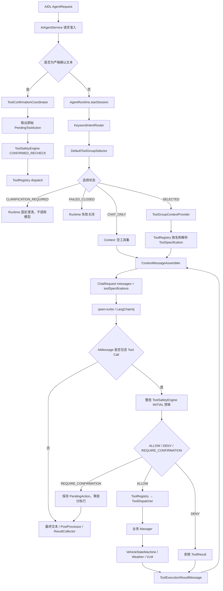

# AIAgent 工具系统设计与现状总结

> 文档日期：2026-07-16  
> 审查范围：README、TEXT 主运行链、IntentRouter、ToolGroup、Context 工具绑定、Tool Calling、ToolSafetyEngine、二次确认、ToolRegistry/ToolDispatcher、业务工具、VehicleStateMachine、Trace 与相关测试  
> 适用阶段：当前 Demo 版本  
> 说明：本文以当前源码为准；其中 ToolGroup 的结论取代 2026-07-10 版本“只进入 Context 文本、尚未限制真实工具”的旧结论。

---

## 1. 总体结论

AIAgent 当前工具系统已经不是“把全部工具交给模型后直接反射执行”的简单 Tool Calling，而是一套由项目自研控制面约束的领域工具系统：

```text
请求准入
→ 确定性意图识别
→ 工具组选择与失败关闭
→ Context 将候选名称解析为真实 ToolSpecification
→ 模型在本轮受限工具集中产生 Tool Call
→ 确定性安全预审
→ 集中式反射分发
→ VehicleStateMachine 参数校验与状态收敛
→ ToolResult 写回模型并继续循环
→ Trace 记录选择、调用、安全、分发和回写证据
```

从当前 TEXT Demo 主链看，工具声明、选择、模型可见性、安全审核、执行和观测已经形成完整闭环，架构边界清晰，具备较好的扩展性和可测试性。LangChain4j 只提供消息、Tool schema 和 Tool Call 原语，真正的业务编排、最小工具暴露、安全控制、执行调度和 Trace 都由项目代码掌握，符合车载 Agent 对确定性与可治理性的要求。

但“工具系统已完善”需要分三个口径理解：

| 口径 | 当前判断 | 说明 |
|---|---|---|
| TEXT + 虚拟车辆 Demo | 基线完整，约 90% | 主链已闭环，核心自动测试充分；仍缺执行授权复核和结构化动作回执 |
| 项目全部输入链路 | 基本可用，约 78% | VOICE、SCENE 仍使用兼容 AgentLoop，没有完整复用 TEXT 的 ToolGroup/Context/确认链 |
| 真车量产工具系统 | 尚未完成，约 50% | 当前车控落到 VehicleStateMachine；SOA 真车回执、幂等、状态回读、功能安全和权限体系仍待建设 |

因此，当前最准确的定位是：**面向 Demo 的 TEXT 工具系统已经达到 P0 基线完成，整体设计合理；它是量产工具执行控制面的良好原型，但还不能等同于真车动作闭环已经完成。**

---

## 2. 技术栈与职责边界

| 层次 | 技术或组件 | 在工具系统中的作用 |
|---|---|---|
| Android 服务入口 | Kotlin、Foreground Service、AIDL、HandlerThread | 接收请求、准入、超时、取消、唯一终态和响应回调 |
| AI 基础原语 | LangChain4j 1.16.3 | 提供 `@Tool`、`@P`、`ToolSpecification`、`ToolExecutionRequest`、`ToolExecutionResultMessage`、`ChatRequest`、`ChatResponse` |
| LLM 接入 | DashScope OpenAI 兼容 API、qwen-turbo | 根据本轮消息和 ToolSpecification 决定是否调用工具以及生成参数 |
| 意图与工具选择 | 自研 `KeywordIntentRouter`、`DefaultToolGroupSelector` | 用确定性规则缩小模型本轮可见工具范围 |
| Context 绑定 | 自研 Context Provider/Assembler | 把 ToolGroup 的 toolName 解析成真实 LangChain4j schema，并独占 TEXT 的最终模型输入 |
| Agent 循环 | 自研 `TextAgentLoopOrchestrator` | 执行“模型—工具—结果回写—模型”的多轮循环 |
| 安全控制 | 自研 `ToolSafetyEngine`、SafetyRule、确认状态机 | 在 dispatch 前完成 ALLOW / DENY / REQUIRE_CONFIRMATION 决策 |
| 工具注册与分发 | 自研 `ToolRegistry`、`ToolDispatcher`、Java Reflection、Gson | 集中注册 schema、解析 `arg0/arg1` JSON 参数并反射调用业务方法 |
| Demo 状态执行 | 自研 `VehicleStateMachine` + 8 个 State POJO | 承担车控参数校验、状态修改和统一状态读取 |
| 外部能力 | OkHttp、高德天气 API、qwen-vl-max、Camera SDK | 提供天气和前向视觉工具 |
| 可观测性 | OpenTelemetry 1.48.0、Phoenix | 记录工具选择、模型 Tool Call、安全、dispatch、writeback 和结果字段 |
| 验证 | JUnit、JVM fake/stub、Gradle | 覆盖 Router、ToolGroup、Context 绑定、安全、确认、分发、Trace 和端到端链路 |

### 2.1 LangChain4j 提供什么

LangChain4j 在本系统中负责标准化 AI Tool Calling 数据结构：

- `@Tool`、`@P`：声明工具名称、用途和参数描述。
- `ToolSpecifications.toolSpecificationsFrom(...)`：从 Manager 类生成模型可读 schema。
- `ChatRequest.toolSpecifications(...)`：将本轮允许的工具发送给模型。
- `AiMessage.toolExecutionRequests()`：读取模型返回的 Tool Call。
- `ToolExecutionResultMessage`：把工具结果与原始 Tool Call ID 配对并写回消息序列。

### 2.2 项目自研什么

以下关键能力不是 LangChain4j 自动提供，而是项目自行实现：

- 请求级 IntentRouter 和 ToolGroup 最小工具暴露。
- Context 对最终工具 schema 的独占装配。
- TEXT Agent 多轮循环及消息持久化顺序。
- ToolSafetyEngine、业务规则和文本二次确认。
- ToolRegistry/ToolDispatcher 集中分发。
- 车辆状态机、业务参数校验和 Demo 状态收敛。
- 请求取消、30 秒 deadline、唯一终态和 late-result 抑制。
- OpenTelemetry 业务 Trace。

这种边界是合理的：框架提供通用协议，项目保留车载业务中的权限、安全和执行主导权。

---

## 3. 工具系统总体架构



架构中存在四个互不替代的“注册/选择”概念：

1. `@Tool` 是业务能力声明。
2. `ToolRegistry` 是实际 schema 和执行目标的注册中心。
3. `ToolGroupRegistry` 是工具分组、上下文需求和风险元数据注册中心。
4. `ToolSafetyEngine` 是 dispatch 前的执行安全策略中心。

ToolGroup 不执行工具，Safety 不生成模型 schema，ToolRegistry 不决定本轮应暴露哪些工具。分层清晰是当前设计的主要优点。

---

## 4. TEXT 工具调用完整运行流程

### 4.1 Service 初始化

`AIAgentService.onCreate()` 完成以下工具系统装配：

1. 创建唯一的 `VehicleStateMachine`。
2. 基于状态机和 `DefaultSafetyRules` 创建全 Persona 共享的 `ToolSafetyEngine`。
3. 创建车门、车窗、座椅、空调、底盘、香氛、车速、DMS、天气和视觉 Provider。
4. 向 `ToolRegistry` 注册 9 个模型工具 Provider，共 46 个 `@Tool`；`VehicleSpeedManager` 只提供状态读取，不注册模型工具。
5. 创建 `ToolConfirmationCoordinator`，其最终执行仍委托全局 `ToolRegistry`。
6. 将 `ToolGroupRegistry` 和实际 `ToolRegistry` 同时注入 `ContextOrchestrator`。
7. 创建 `TextAgentLoopOrchestrator`，注入 Context、Memory、Safety 和确认协调器。
8. 创建 `AgentRuntime`，把 TEXT 执行委托给 TextAgentLoop。

### 4.2 请求准入与确认分流

`handleTextRequest()` 首先规范化 requestId、userId 和 Persona，并创建 30 秒绝对期限。`ActiveRequestRegistry` 提供单槽位准入和重复 requestId 防护。

在 IntentRouter 前，Service 使用 `ConfirmationTextParser` 严格判断：

- 完全等于 `确认执行`：进入确认执行分支。
- 完全等于 `取消执行`：进入确认取消分支。
- 其他文本：取消旧 PendingAction，进入普通工具选择链。

确认文本不再交给 LLM 解释，避免模型把模糊表达误判为授权。

### 4.3 IntentRouter

`KeywordIntentRouter` 对标准化文本执行关键词和少量正则匹配：

- 空文本：`UNKNOWN / NONE`。
- 无业务关键词：`CHAT / LOW`。
- 有命中：按各领域命中数选择最高分标签。
- 平分：依赖 `LinkedHashMap` 的稳定顺序选择优先级更高的领域。
- 命中 1 个规则为 MEDIUM，命中至少 2 个为 HIGH。

当前 11 种标签包括 CHAT、7 个车辆域、WEATHER、VISION_QA 和 UNKNOWN。Intent 只做粗分类，不直接执行工具。

### 4.4 ToolGroup 选择

`DefaultToolGroupSelector` 将 IntentTag 映射为选择状态：

| 场景 | 状态 | 行为 |
|---|---|---|
| 明确车辆、天气或视觉领域 | `SELECTED` | 选择对应领域组；车辆域同时携带 BASIC_STATUS_GROUP |
| 普通聊天 | `CHAT_ONLY` | 模型可见工具为空 |
| CHAT/UNKNOWN 但含弱车载表达 | `CLARIFICATION_REQUIRED` | Runtime 直接要求用户澄清，不调用模型 |
| Selector 异常、null 或结果不一致 | `FAILED_CLOSED` | Runtime 在 Context/模型前终止 |

`AgentRuntime` 还会校验最小不变量：SELECTED 必须有非空组和非空工具；其他状态必须保持空工具。默认 Selector 不主动启用全量 fallback。

### 4.5 Context 将名称变成真实工具 schema

ToolGroup 的选择结果保存在不可变 `RequestSession` 中。`ToolGroupContextProvider` 只对 `SELECTED` 状态工作：

1. 读取 `selectedToolNames`。
2. 调用实际 `ToolRegistry.toolSpecificationsByNames(...)`。
3. 任一名称不存在时返回 `TOOL_SPEC_RESOLUTION_FAILED`，不会静默忽略。
4. 输出 `ToolContextContribution`。
5. `ContextMessageAssembler` 合并去重 schema，并生成最终 `ContextAssemblyResult.toolSpecifications()`。

因此，当前 ToolGroup 不再只是提示模型的文字元数据，而是实际控制 `ChatRequest.toolSpecifications()`。例如空调请求只会向模型暴露 15 个 AC 工具，而不是全部 46 个工具。

车辆域选择同时携带 `requiredContextKeys=[user_id, vehicle_status]`，使 `VehicleStateContextProvider` 在每轮 assemble 时读取最新车辆状态；普通聊天不会注入车辆状态。

### 4.6 模型 Tool Call 与 Agent 循环

`TextAgentLoopOrchestrator` 每轮执行：

1. Context assemble，得到本轮消息、工具和预算报告。
2. 检查 deadline、取消和 Token 预算。
3. 构造 `ChatRequest(messages, toolSpecifications)`。
4. `Lc4jModelCaller` 调用 `ChatModel.chat(request)`。
5. 若模型返回纯文本，进入 PostProcessor、Terminator 和 ResultCollector。
6. 若模型返回 Tool Call，将 ToolCall AiMessage 先写入 ChatMemory，保证 ToolResult 序列合法。
7. 对整批 Tool Call 完成安全预审。
8. 对可执行项进行 dispatch，对拒绝项生成拒绝 ToolResult。
9. 将每个结果以 `ToolExecutionResultMessage` 写入 Memory，同时写入 `AgentLoopContext`。
10. 进入下一轮 Context assemble，让模型基于工具结果生成最终回答或继续调用工具。

### 4.7 安全预审与零部分执行

当前安全引擎提供三个结果：

- `ALLOW`：允许进入 dispatch。
- `DENY`：不执行，写入带稳定 reasonCode 的拒绝结果。
- `REQUIRE_CONFIRMATION`：本批工具全部不执行。

整批预审的价值是避免如下情况：模型一次返回“打开空调 + 解锁车门”，如果解锁需要确认，系统不会先打开空调再停下来确认，从而避免用户看到半完成状态。

当前两个专用安全工具为：

| 工具 | 初次审核 | 确认后复核 |
|---|---|---|
| `set_door_lock(false)` 解锁 | 车速为 0 时要求确认；车速非 0 时拒绝 | 再读车速，仍为 0 才放行 |
| `set_chassis_mode(...)` | 车速为 0 时要求确认；车速非 0 时拒绝 | 再读车速，仍为 0 才放行 |

锁车始终允许。没有专用规则的低风险工具默认允许；已列入 HIGH 工具集合但缺少专用规则时失败关闭。

### 4.8 二次确认

`ToolConfirmationCoordinator` 保存的是首次模型产生的原始 Tool Call，而不是第二条确认文本重新生成的参数：

- PendingAction TTL 为 30 秒。
- 新普通请求会取消旧动作。
- 参数保存为规范化 JSON 对象。
- 只支持单个待确认动作。
- 原子领取确保并发确认最多执行一次。
- 不同 sessionId 无法消费该动作。
- 确认时使用同一个 ToolSafetyEngine 读取最新状态并复核。
- 状态变化、过期、取消、重复确认或请求终止均不会 dispatch。

这套设计避免了“第一次说解锁，第二次确认时参数被替换成另一个动作”的授权漂移。

### 4.9 工具分发与结果回写

`ToolRegistry` 根据 toolName 找到对应 `ToolDispatcher`。Dispatcher 使用反射调用 Manager 方法：

1. 校验 ToolExecutionRequest 和工具注册状态。
2. 将 arguments 解析成 JSON object。
3. 按 `arg0`、`arg1` 等位置键解析 boolean、int 或 String。
4. 反射调用目标方法。
5. 返回 `ToolDispatchOutcome`，区分注册、参数解析、反射调用和技术分发状态。

车辆 Manager 本身很薄，实际参数范围校验和状态修改由 `VehicleStateMachine` 完成。天气和视觉工具则调用外部服务。

---

## 5. ToolGroup 设计

### 5.1 13 个工具组

| ToolGroupId | 工具数 | 风险 | requiredContextKeys | 用途 |
|---|---:|---|---|---|
| CHAT_ONLY_GROUP | 0 | LOW | 无 | 普通对话 |
| BASIC_STATUS_GROUP | 0 | LOW | user_id、vehicle_status | 车辆域上下文标记，不是执行工具组 |
| AC_GROUP | 15 | MEDIUM | user_id、vehicle_status | 空调与温控 |
| WINDOW_GROUP | 11 | MEDIUM | user_id、vehicle_status | 车窗、天窗、除霜和后视镜 |
| SEAT_GROUP | 11 | MEDIUM | user_id、vehicle_status | 座椅和方向盘 |
| DOOR_GROUP | 1 | HIGH | user_id、vehicle_status | 门锁 |
| CHASSIS_GROUP | 1 | HIGH | user_id、vehicle_status | 底盘模式 |
| FRAGRANCE_GROUP | 2 | LOW | user_id、vehicle_status | 香氛 |
| DMS_GROUP | 3 | MEDIUM | user_id、vehicle_status | 驾驶员状态 |
| WEATHER_GROUP | 1 | LOW | 无 | 天气查询 |
| VISION_GROUP | 1 | LOW | 无 | 前向视觉问答 |
| COMMON_VEHICLE_GROUP | 44 | HIGH | user_id、vehicle_status | 全车辆域聚合组 |
| ALL_SAFE_DEMO_GROUP | 46 | HIGH | 无 | Demo 全量聚合组 |

聚合组的风险等级按成员最高风险上浮，但这个 riskLevel 当前是元数据；真正执行安全由 `DefaultSafetyRules` 的具体 toolName 映射决定。

### 5.2 选择结果契约

`ToolGroupSelectionResult` 不只携带工具名，还包含：

- 稳定状态 `status`
- groupId 和 toolName
- selectionReason、confidence、fallbackUsed
- requiredContextKeys、highestRiskLevel
- allToolsFallback、containsAggregationGroup

生产 Selector 使用 Registry 驱动的工厂方法推导派生字段，降低调用方手写工具名、风险和 Context key 不一致的概率。

### 5.3 双注册表一致性

系统存在两个目的不同的注册表：

- `ToolRegistry`：真实 LangChain4j schema 和执行 Dispatcher。
- `ToolGroupRegistry`：分组、风险和 Context 元数据。

`validateAgainstToolSpecifications()` 可双向检查：

- `missingToolNames`：ToolGroup 声明了但真实 schema 不存在。
- `ungroupedToolNames`：真实 schema 存在但未被 ToolGroup 覆盖。

当前真实 Manager 规格测试覆盖了 46 对 46 的一致性，但生产启动阶段尚未强制 fail-fast。

---

## 6. 当前工具清单

当前模型工具总数为 46：44 个车辆域工具、1 个天气工具、1 个视觉工具。车速修改能力没有注册给模型。

| 文件 / 领域 | 数量 | toolName |
|---|---:|---|
| VehicleAcManager | 15 | `set_ac_status`、`set_ac_drive_temp`、`set_ac_assist_temp`、`set_ac_fan_intensity`、`set_ac_eco_mode`、`set_ac_anion_status`、`set_ac_clean_mode`、`set_ac_cyc_mode`、`set_ac_drive_sweep_auto`、`set_ac_assist_sweep_auto`、`set_ac_drive_left_air_outlet`、`set_ac_drive_right_air_outlet`、`set_ac_assist_air_outlet_mode`、`set_ac_assist_left_air_outlet`、`set_ac_assist_right_air_outlet` |
| VehicleWindowManager | 11 | `set_fl_window_status`、`set_fr_window_status`、`set_rl_window_status`、`set_rr_window_status`、`set_top_window_status`、`set_sun_shadow_status`、`set_window_f_defrosting`、`set_window_r_heat`、`set_mirror_l_heat`、`set_mirror_r_heat`、`set_no_window_opening_passengers` |
| VehicleSeatManager | 11 | `set_seat_fl_heat`、`set_seat_fr_heat`、`set_seat_rl_heat`、`set_seat_rr_heat`、`set_seat_fl_air`、`set_seat_fr_air`、`set_seat_rl_air`、`set_seat_rr_air`、`set_seat_massage_mode`、`set_seat_massage_intensity`、`set_steering_heat` |
| VehicleDoorManager | 1 | `set_door_lock` |
| VehicleChassisManager | 1 | `set_chassis_mode` |
| VehicleFragManager | 2 | `set_frag_type`、`set_frag_intensity` |
| VehicleDMSManager | 3 | `set_dms_drive_fatigue`、`set_dms_drive_distractionlevel`、`set_dms_drive_emotion` |
| WeatherUtils | 1 | `getWeatherForecast` |
| VlManager | 1 | `front_camera_interaction` |
| VehicleSpeedManager | 0 | 只向车辆状态 Context 提供当前车速，不允许模型修改车速 |

---

## 7. 各模块与文件职责

### 7.1 Service、Runtime 与 AgentLoop 集成文件

| 文件 | 作用 |
|---|---|
| `AIAgentService.kt` | 工具系统装配根；创建状态机、安全引擎、业务 Manager、ToolRegistry、Context、TextAgentLoop 和确认协调器；负责请求准入、确认分流、超时、取消和响应派发 |
| `runtime/AgentRuntime.java` | 在模型前执行 IntentRouter 和 ToolGroupSelector；校验选择契约；处理澄清/失败关闭；调用 Context prepare 和 TEXT executor；写入 intent/toolgroup Trace |
| `runtime/RequestSession.java` | 保存单次请求不可变事实，包括 intent、ToolGroup 选择结果、deadline、身份和 TraceContext |
| `runtime/RequestSessionFactory.java` | 规范化请求字段；为缺失 Intent 降级 UNKNOWN，为缺失 ToolGroup 失败关闭；构造 Context 使用的 canonical 字段 |
| `core/TextAgentLoopOrchestrator.java` | TEXT 主 Tool Loop；每轮消费 Context 生成的真实 schema，执行整批安全预审、dispatch、ToolResult 回写和下一轮模型调用 |
| `core/AgentLoopOrchestrator.java` | VOICE/SCENE 等兼容链；仍使用构造时固定的 effectiveToolSpecs，共用 ToolSafetyEngine，但不具备 TEXT 的 ToolGroup/Context/文本确认完整能力 |
| `core/AgentConfig.java` | 保存模型、循环次数、Memory 策略、ToolExecutor/ToolRegistry、后处理和终止策略 |
| `core/factory/AgentConfigFactory.java` | 创建 TEXT、CHAT、SCENE、VISION 配置；TEXT 注入全局 ToolRegistry，但工具可见性由 Context 决定 |
| `core/component/ModelCaller.java` | 模型调用抽象接口 |
| `core/model/Lc4jModelCaller.java` | LangChain4j ChatModel 的薄适配层 |
| `core/component/ToolExecutor.java` | 工具执行函数接口；兼容链和确认协调器用它隔离具体 Registry |
| `core/AgentLoopContext.java` | 保存当前迭代和 ToolExecutionRecord，供后处理、终止和结果收集使用 |
| `core/ToolExecutionRecord.java` | 单次工具调用的名称、参数、结果和安全决定快照 |

### 7.2 IntentRouter 文件

| 文件 | 作用 |
|---|---|
| `intentrouter/IntentTag.java` | 定义 11 个粗粒度业务领域 |
| `intentrouter/IntentConfidence.java` | 定义 HIGH / MEDIUM / LOW / NONE |
| `intentrouter/IntentResult.java` | 不可变意图结果，携带标签、置信度、命中词、标准化文本、输入类型和调试原因 |
| `intentrouter/IntentRouter.java` | 可替换的路由接口，不依赖 Android、LLM、Registry 或 Memory |
| `intentrouter/KeywordIntentRouter.java` | 默认关键词+正则实现，使用稳定优先级和单标签 winner 策略 |

### 7.3 ToolGroup 文件

| 文件 | 作用 |
|---|---|
| `toolgroup/ToolGroupId.java` | 定义 13 个基础、领域、上下文标记和聚合组 ID |
| `toolgroup/ToolGroup.java` | 不可变组元数据；保存名称、描述、toolName、Context key、风险和 enabled 状态 |
| `toolgroup/ToolGroupRegistry.java` | 注册 13 个组；合并、去重、反查；推导 Context key 和最高风险；校验真实 LangChain4j schema |
| `toolgroup/ToolGroupRegistryValidationResult.java` | 保存 missing、ungrouped 和校验摘要 |
| `toolgroup/ToolGroupSelectionInput.java` | 为未来小模型/子 Agent Selector 预留更完整输入，同时保持当前接口兼容 |
| `toolgroup/ToolGroupSelectionStatus.java` | 定义 SELECTED / CHAT_ONLY / CLARIFICATION_REQUIRED / FAILED_CLOSED 稳定状态 |
| `toolgroup/ToolGroupSelectionResult.java` | 不可变选择结果及 Registry 派生字段；提供 selected/chatOnly/clarification/failedClosed/allToolsFallback 工厂 |
| `toolgroup/ToolGroupSelector.java` | 选择策略接口；保留二参数 SAM，另提供完整输入默认方法 |
| `toolgroup/DefaultToolGroupSelector.java` | IntentTag 到最小领域工具组的默认确定性映射；弱车载表达澄清；异常输入失败关闭 |

### 7.4 Context 工具绑定文件

| 文件 | 作用 |
|---|---|
| `context/provider/ToolGroupContextProvider.java` | SELECTED 时从真实 ToolRegistry 解析 schema；其他状态输出空工具；解析失败阻止模型调用 |
| `context/ToolContextContribution.java` | 不可变承载 ToolSpecification，并标记 SELECTED / ALL_FALLBACK / NONE |
| `context/ContextPolicies.java` | 把 tool_group 定义为 REQUEST_STATIC、TRUSTED_SYSTEM、CRITICAL；仅 SELECTED 时 required；根据 requiredContextKeys 决定车辆状态可见性 |
| `context/ContextMessageAssembler.java` | 合并去重 ToolSpecification，检测同名不同 schema 冲突，产出最终模型工具列表 |
| `context/ContextAssemblyResult.java` | 向 TextAgentLoop 返回最终 messages、toolSpecifications 和预算结果；失败时不返回半成品工具列表 |
| `context/ContextOrchestrator.java` | 调度 Provider、prepare/assemble、预算和失败策略，是 TEXT 工具 schema 的统一装配入口 |
| `context/ContextTraceRecorder.java` | 记录 context.toolset、工具数量、名称和 schema 来源 |

### 7.5 集中注册与分发文件

| 文件 | 作用 |
|---|---|
| `ai/langchain4j/tool/ToolRegistry.java` | 注册 Provider、收集全部 LangChain4j schema、按名称解析本轮 schema、按 toolName 找 Dispatcher、返回结构化分发结果 |
| `ai/langchain4j/tool/ToolDispatcher.java` | 反射扫描单个 Provider 的 @Tool；解析 JSON 位置参数；调用目标方法；提供目标类/方法诊断 |
| `ai/langchain4j/tool/ToolDispatchOutcome.java` | 结构化表达 registered、argumentParseSuccess、invokeSuccess、dispatchSuccess、结果和技术错误 |
| `ai/langchain4j/tool/ToolSpecNotFoundException.java` | Context 按名称解析不存在工具时的明确异常 |

### 7.6 Safety 与确认文件

| 文件 | 作用 |
|---|---|
| `safety/SafetyDecision.java` | 定义 ALLOW / DENY / REQUIRE_CONFIRMATION 及稳定 ReasonCode |
| `safety/SafetyCheckMode.java` | 区分 INITIAL 和 CONFIRMED_RECHECK，防止确认布尔值直接绕过规则 |
| `safety/SafetyCheckContext.java` | 向规则提供工具名、标准化 JSON 参数和审核阶段 |
| `safety/SafetyRule.java` | 确定性规则接口；只读状态，不修改车辆 |
| `safety/DefaultSafetyRules.java` | 集中映射门锁和底盘规则；维护必须具有专用规则的 HIGH 工具集合 |
| `safety/ToolSafetyEngine.java` | 安全审核唯一入口；解析参数、选择规则、异常失败关闭、格式化拒绝结果 |
| `safety/rules/DoorUnlockSafetyRule.java` | 静止解锁要求确认，行驶中拒绝，锁门放行 |
| `safety/rules/ChassisModeSafetyRule.java` | 静止切换底盘模式要求确认，行驶中拒绝 |
| `safety/confirmation/ConfirmationTextParser.java` | 只接受“确认执行”和“取消执行”两个精确命令 |
| `safety/confirmation/PendingToolAction.java` | 保存不可变原始 Tool Call、session、请求 ID、TTL 和原子状态 |
| `safety/confirmation/PendingToolActionStore.java` | 单槽位 PendingAction 存储；支持原子领取、过期、取消和并发防重 |
| `safety/confirmation/ConfirmationExecutionResult.java` | 确认分支的确定性结果对象 |
| `safety/confirmation/ToolConfirmationCoordinator.java` | 创建 PendingAction；确认时重新安全审核并最多 dispatch 一次 |

### 7.7 业务 Tool Provider 文件

| 文件 | 作用 |
|---|---|
| `tools/vehicle/ac/VehicleAcManager.java` | 暴露 15 个空调工具，状态读取和执行均委托 VehicleStateMachine |
| `tools/vehicle/window/VehicleWindowManager.java` | 暴露 11 个车窗、天窗、除霜、加热工具 |
| `tools/vehicle/seat/VehicleSeatManager.java` | 暴露 11 个座椅和方向盘工具 |
| `tools/vehicle/door/VehicleDoorManager.java` | 暴露门锁工具；公共常量同时供 Safety 映射，避免改名导致规则失效 |
| `tools/vehicle/chassis/VehicleChassisManager.java` | 暴露底盘模式工具；公共常量同时供 Safety 映射 |
| `tools/vehicle/frag/VehicleFragManager.java` | 暴露香氛类型和强度工具 |
| `tools/vehicle/dms/VehicleDMSManager.java` | 暴露疲劳、分心和情绪状态工具 |
| `tools/vehicle/speed/VehicleSpeedManager.java` | 只提供状态采集，不含 @Tool，避免模型改变 Demo 车速 |
| `tools/external/weather/WeatherUtils.java` | 地址转 adcode，使用高德 API 查询 1—4 天天气，同步等待异步 OkHttp 结果 |
| `tools/vision/vl/VlManager.java` | 使用最新前向图像或默认图像调用 qwen-vl-max，返回视觉回答和警告文本 |

### 7.8 VehicleStateMachine 文件

| 文件 | 作用 |
|---|---|
| `VirtualStateMachine/VehicleStateMachine.java` | Demo 车控唯一状态入口；校验范围/枚举，修改状态，输出各子系统 JSON 状态 |
| `state/AcState.java` | 保存空调开关、温度、风量、模式和出风口状态 |
| `state/DoorState.java` | 保存四门开闭和门锁状态 |
| `state/WindowState.java` | 保存各车窗、天窗、遮阳帘、除霜和后视镜加热状态 |
| `state/SeatState.java` | 保存座椅加热、通风、按摩和方向盘加热状态 |
| `state/SpeedState.java` | 保存 volatile 当前车速，供安全规则实时读取 |
| `state/ChassisState.java` | 保存当前底盘模式 |
| `state/FragState.java` | 保存香氛类型和强度 |
| `state/DmsState.java` | 保存疲劳、分心和情绪状态 |

### 7.9 Trace 文件

| 文件 | 作用 |
|---|---|
| `trace/AgentTraceRecorder.java` | 记录 LLM 请求/响应、`gen_ai.tool_calls`、Safety、tool.execute、dispatch、writeback 和结构化 outcome |
| `trace/ContextTraceRecorder.java` | 记录 ToolGroup Provider 的输出工具集和 schema |
| `trace/TraceSpanNames.java` | 集中定义 `gen_ai.chat`、`tool.safety_check`、`tool.execute`、`tool.dispatch`、`tool.result_writeback` 等 Span 名称 |
| `trace/TraceAttributeKeys.java` | 集中定义工具名、参数、安全决定、目标类/方法、解析/调用结果、确认状态等属性 |
| `trace/TraceSession.java` / `TraceContext.java` | 维持单请求 Trace root 和跨 Runtime/Context/AgentLoop 的上下文传递 |

---

## 8. Trace 中如何判断工具链是否工作

### 8.1 普通成功工具调用

当前 TEXT 实现先完成整批 Safety 预审，再创建各自的 `tool.execute`，所以实际关键 Span 顺序是：

```text
agent.request
└─ agent.loop
   └─ agent.iteration
      ├─ context.assemble
      ├─ gen_ai.chat
      │  ├─ gen_ai.request.tool_count > 0
      │  └─ gen_ai.tool_calls = 目标工具名
      ├─ tool.safety_check
      │  └─ tool.safety.decision = ALLOW
      └─ tool.execute
         ├─ tool.name / tool.arguments
         ├─ tool.dispatch
         │  ├─ tool.dispatch_success
         │  ├─ tool.argument_parse_success
         │  └─ tool.invoke_success
         └─ tool.result_writeback
```

下一轮 iteration 会再次 assemble，并用 ToolResult 生成最终文本。

### 8.2 安全拒绝

- `gen_ai.tool_calls` 存在。
- `tool.safety_check` 的 decision 为 DENY。
- 存在 `tool.execute` 和 `tool.result_writeback`，用于记录拒绝结果。
- 不存在 `tool.dispatch`，因为业务实现没有执行。
- `tool.outcome=VETOED`，`tool.success=false`。

### 8.3 需要二次确认

- 首次请求有 `gen_ai.tool_calls` 和 `tool.safety_check=REQUIRE_CONFIRMATION`。
- 整批零执行，因此当前实现不会创建 `tool.execute` / `tool.dispatch`。
- root span 记录 confirmationId 和 PENDING 状态。
- 第二条“确认执行”由 Service 直接处理，不经过 IntentRouter 和 LLM。

### 8.4 关键判定原则

- `gen_ai.request.tool_count > 0` 只说明模型收到了工具 schema。
- `gen_ai.tool_calls` 说明模型发起了调用。
- `tool.execute` 说明 AgentLoop 进入了该 Tool 的处理阶段。
- `tool.dispatch_success=true` 只说明参数解析和 Java 方法调用完成，不一定说明车辆目标真实达成。
- 最终业务状态仍应结合 `tool.output` 和 VehicleStateMachine/真车状态回读判断。

---

## 9. 非 TEXT 输入链路边界

| 输入/场景 | 当前路径 | 与 TEXT 主链的差异 |
|---|---|---|
| TEXT | AgentRuntime + Context + TextAgentLoop | 当前完整主链，支持 ToolGroup、失败关闭、动态 schema 和文本确认 |
| VOICE | `chatOrchestrator.execute(...)` | 使用兼容 AgentLoop 和构造时固定全量工具；共用 Safety，但不经过 IntentRouter/ToolGroup/Context；确认型动作按“确认通道不可用”拒绝 |
| 主动场景 | `createScenePersona` + 兼容 AgentLoop | 使用静态 SCENE_TOOL_MAP 过滤；共用 Safety，但不经过 TEXT ToolGroup/Context/确认链 |
| IMAGE | Service 直接调用 `VlManager.frontCameraInteractionPositive` | 不经过 LLM Tool Calling |
| CONTROL | Service 内部命令分支 | 不属于模型工具系统 |

这一区分很重要：不能用 TEXT 工具系统已经完成，推导出 VOICE 和 SCENE 已经获得相同的最小权限、确认和 Context 能力。

---

## 10. 自动测试与验证覆盖

当前源码已经提供较系统的测试：

- Intent：关键词、正则、空输入、优先级平分和全部领域。
- ToolGroup：13 组注册、映射、风险上浮、聚合组、fallback、不可变性和 46 个真实 schema 双向一致性。
- Context：SELECTED 只输出目标工具；CHAT_ONLY、澄清和失败关闭输出空工具；端到端验证 AC 工具进入模型、聊天绕过 ToolRegistry、车辆状态按需注入。
- Dispatch：成功、参数失败、未注册工具的结构化 outcome。
- Safety：非法配置、参数错误、规则异常、HIGH 规则漏配、规则顺序和稳定 reasonCode。
- Confirmation：严格文本、原始参数、过期、状态变化、跨 Session、防并发重复执行和请求取消。
- AgentLoop：工具结果回写、多工具取消、deadline 和下一轮模型调用。
- Trace：正常工具三阶段、DENY 无 dispatch、多 Tool、dispatch 异常和第二 iteration。

测试覆盖对 Demo 代码质量提供了较强保障，但仍需保留真实模型和设备验收，因为关键词路由、Qwen Tool Call 稳定性、Phoenix 展示和外部服务行为无法仅靠 JVM fake 完全证明。

本次文档复核执行了 `testDebugUnitTest`。Gradle 判定测试任务为最新状态并成功结束；现有 XML 结果共 62 个测试套件、354 个测试，failure/error/skipped 均为 0。该结果证明当前仓库自动测试基线为绿色，但不是本轮重新连接真实模型、Phoenix 或车机设备的手动验收结果。

---

## 11. 设计合理性与完成度评估

### 11.1 分项评分

| 评估项 | 评分 | 结论 |
|---|---:|---|
| 架构分层 | 9/10 | 声明、选择、绑定、安全、分发、状态和观测职责清晰 |
| TEXT 最小工具暴露 | 9/10 | ToolGroup 已真实控制 schema；聊天空工具、异常失败关闭 |
| ToolRegistry/Dispatcher | 8.5/10 | 集中注册和结构化诊断成熟；参数命名与业务结果语义仍可加强 |
| 安全与确认 | 8.5/10 | 确定性规则、整批预审、原始动作和复核设计合理；当前规则数量有限且 Store 为单槽位 |
| Context 集成 | 9/10 | ToolGroup 已成为真实输入控制层，解析失败不调用模型 |
| Trace 可观测性 | 8/10 | 主链字段完整；Safety 层级、确认执行分支和业务回执仍有提升空间 |
| 自动测试 | 9/10 | 核心策略、异常和并发边界都有专项测试 |
| 多输入链一致性 | 6/10 | VOICE/SCENE 仍是兼容路径，未复用完整 TEXT 控制面 |
| 真车动作闭环 | 4/10 | 当前以 VehicleStateMachine 为终点，尚无真实 SOA 回执和状态确认 |

### 11.2 设计优点

1. **最小权限已经进入真实模型请求。** ToolGroup 不再停留在元数据层。
2. **异常倾向失败关闭。** Selector、Context schema、安全规则异常都不会自动扩大权限。
3. **安全与模型解耦。** Prompt 不能替代 ToolSafetyEngine，模型也不能通过话术绕过确定性规则。
4. **确认保存原始动作。** 第二次请求不能修改首次动作参数。
5. **整批预审避免部分执行。** 对并行 Tool Call 尤其重要。
6. **结构化技术结果替代错误文本猜测。** `ToolDispatchOutcome` 明确区分注册、解析和调用。
7. **Demo 状态统一。** VehicleStateMachine 消除了各 Manager 各自维护状态造成的漂移。
8. **Trace 可解释。** 可以区分“工具已提供”“模型已调用”“安全已审核”“代码已执行”“结果已回写”。

### 11.3 当前主要缺口

#### 1. 工具可见性还不是最终执行授权

Context 只把本轮选中工具交给模型，但 TextAgentLoop 收到 ToolExecutionRequest 后，直接交给全局 ToolRegistry。当前没有在 dispatch 前再次校验：

```text
request.name 是否属于 session.toolGroupSelectionResult.selectedToolNames
```

正常模型一般不会调用未提供的 schema，但执行边界不应依赖模型自律。该项是当前 TEXT 工具权限闭环中最值得优先补齐的缺口。

#### 2. 技术调用成功不等于业务动作成功

VehicleStateMachine 对非法范围通常返回错误字符串而不抛异常。反射调用本身完成后，`ToolDispatchOutcome.dispatchSuccess` 会是 true，因此 Trace 的 `tool.success` 可能表示“Java 方法成功返回”，而不是“车辆状态已经达到目标”。

#### 3. 最终回复真实性仍主要依靠 Prompt

Prompt 已要求工具成功后才能声称完成，但尚无确定性的结果门控把 APPLIED / REJECTED / FAILED / PARTIAL / UNKNOWN 映射到最终回答约束。

#### 4. 两套 Registry 依赖手动同步

测试能发现 ToolGroupRegistry 与真实 schema 漂移，但 Service 启动时没有强制校验。错误若绕过 CI，可能在运行时直到某个请求进入 Context 才暴露。

#### 5. 非 TEXT 链路没有统一治理

VOICE 使用全量固定工具，SCENE 使用静态映射。尤其 `SCENE_TOOL_MAP` 中仍存在旧工具名称，与当前 46 个名称只部分重合，可能造成场景工具集合过少或为空。

#### 6. 参数协议与注释不完全一致

`ToolDispatcher` 类注释描述“优先命名键、回退 argN”，实际实现只读取 `arg0/arg1...`。当前 Qwen schema 可配合该协议工作，但对未来模型、显式参数名和代码重构较脆弱。

#### 7. 确认 Store 是全局单槽位

当前项目采用单 TEXT 准入，因此 Demo 可工作；如果未来允许多个用户/Session 并发，一个全局槽位会造成新 PendingAction 覆盖旧动作。届时应升级为 `sessionId → PendingToolAction` 的并发映射。

#### 8. Trace 的安全预审层级存在认知差异

代码实际在创建 `tool.execute` 前执行整批 `tool.safety_check`，因此 Safety Span 当前是 iteration 下的预审 Span，而 `AgentTraceRecorder` 注释仍写成 tool.execute 子 Span。多工具场景下 Safety Span 也没有直接记录 toolName，排查时依赖顺序对应。

#### 9. 真车执行链尚未建立

VehicleStateMachine 是 Demo 状态中心，不是 ECU/SOA 动作回执。量产系统还需要调用身份、动作幂等、超时、设备拒绝、状态回读和审计证据。

---

## 12. 改进建议与优先级

### P0：形成真正的执行授权和动作证据闭环

1. **Dispatch 前授权复核**  
   在 TextAgentLoop 的 Tool Call 入口校验 toolName 属于本轮 `selectedToolNames`；不属于时生成稳定的 `TOOL_NOT_AUTHORIZED_FOR_REQUEST` 结果，禁止进入 Safety 和 Registry。

2. **引入结构化 ActionReceipt**  
   将结果统一为 `APPLIED / REJECTED / FAILED / PARTIAL / UNKNOWN`，至少包含目标状态、执行状态、错误码、设备回执和是否完成状态回读。

3. **最终回答证据门控**  
   最终文本只允许根据 ActionReceipt 声称完成；没有 APPLIED 证据时禁止生成完成性结论。

### P1：统一全部输入链路

4. **抽取共享 ToolExecutionPipeline**  
   将“本轮授权 → Safety → Dispatch → Receipt → Trace → Writeback”从 TextAgentLoop 中抽成共享组件，VOICE/SCENE 复用同一条执行控制面。

5. **修正 SCENE_TOOL_MAP**  
   使用当前 ToolGroupRegistry 或 toolName 常量生成场景集合，删除旧工具名，增加双向一致性测试。

6. **VOICE 接入 Intent/ToolGroup/Context**  
   如果 VOICE 是正式入口，应先把 ASR 文本转换成与 TEXT 相同的 RequestSession，而不是直接使用全量固定工具。

7. **Registry 启动校验**  
   Service 初始化后立即运行 ToolGroupRegistry 与真实 ToolSpecification 的双向校验；Debug 直接失败，Release 至少禁用不一致工具并上报 Trace。

### P1：增强路由和安全策略

8. **Intent 从单标签升级为任务语义**  
   区分 QUERY / ACTION / CONDITIONAL_ACTION / MULTI_ACTION，并支持多领域结果。ToolGroup 仍可作为候选集合，不必让 Router 直接执行工具。

9. **安全策略扩展**  
   对车窗、座椅、空调等动作逐步加入车速、门状态、乘员位置和设备可用性规则；风险元数据应作为校验输入，但不能替代具体业务规则。

10. **确认 Store 按 Session 隔离**  
    当单槽位准入取消或支持多用户并发时，迁移为 session-scoped Store，并增加用户身份与 Binder caller 绑定。

### P2：可维护性与观测增强

11. **明确工具参数协议**  
    统一生成显式参数名或正式声明只支持 argN；修正文档与实现不一致，并为多参数、类型错误和模型差异增加契约测试。

12. **增强 Trace**  
    在 `tool.safety_check` 记录 toolName、toolCallId 和 batchIndex；为第二条确认请求补齐 recheck/dispatch/receipt Span；把技术成功和业务成功拆成不同字段。

13. **ToolRegistry 多次注册语义收口**  
    当前生产只调用一次 `registerAll()`；仍建议拒绝跨调用重复工具，或明确提供一次性 `freeze()`，避免 dispatchers 与 allSpecs 发生漂移。

14. **真实模型稳定性评测**  
    为每个 ToolGroup 建立固定指令集，统计正确工具率、正确参数率、未授权调用率、无需工具时误调用率和失败后虚假完成率。

---

## 13. 最终评价

当前工具系统的核心方向是正确的：**模型负责理解与选择，项目代码负责授权、安全、执行和证据。** 相比由模型自由调用全量工具的普通 Agent，这套设计更适合车辆控制场景。

TEXT Demo 已经具备以下完整能力：

- 可解释的意图路由。
- 请求级最小工具暴露。
- ToolGroup 到真实 schema 的动态绑定。
- 异常失败关闭。
- 多轮 Tool Loop。
- 独立确定性安全审核。
- 高风险文本确认和实时状态复核。
- 集中反射调度和结构化技术结果。
- 虚拟车辆状态收敛。
- 覆盖工具链关键阶段的 Trace 与测试。

下一阶段不需要推翻现有工具系统，而应围绕三个闭环继续收口：

1. **本轮工具可见集合 → Dispatch 授权集合**。
2. **Java 方法返回 → 结构化车辆动作回执 → 状态回读**。
3. **TEXT 完整主链 → VOICE/SCENE 共享执行控制面**。

完成这三点后，工具系统才会从“成熟的 Demo Tool Calling 系统”进一步成为“可接入真实车辆执行面的受控 Agent 工具体系”。
