# 车载智能 Agent RAG 系统首轮交付工作总结

> 文档状态：首轮“能力跑通”总结（`TEST_ONLY`）。  
> 更新日期：2026-07-22。  
> 适用范围：AIAgent Android 运行时、离线知识库构建工具、共享数据协议及当前 Model Y 试运行资料。  
> 重要边界：本文不将尚未完成的正式知识库发布、APK 内置交付和目标车机验证描述为已完成。

## 1. 执行摘要（Executive Summary）

### 背景与目标

项目需要为纯后台运行的 AIAgent 车载语音服务引入车辆知识问答能力，使 Agent 能在不依赖模型自由编造的前提下，基于车型、年款、市场和配置等可信车辆状态检索受控资料，并向用户返回可追溯来源的回答。

本轮核心目标是建立一条可验证的最小闭环：**离线解析 PDF/静态 HTML/Markdown → 分块与向量化 → ObjectBox 知识库构建 → Android 端加载与混合检索 → Agent Tool Calling → 证据引用与安全失败**。在已授权的 Model Y PDF 与静态 HTML 资料上，完成 `TEST_ONLY` 端到端试运行。

### 整体完成度

**首轮“能力跑通”目标已完成：离线构建、独立校验、Android 接入及 Automotive API 35 虚拟设备联调均已有通过证据；正式发布目标尚未完成，当前总体状态为 `IN_PROGRESS`，真实资料候选仍为 `TEST_ONLY`。**

| 交付维度 | 当前结论 |
|---|---|
| RAG 架构与共享协议 | 已完成 |
| 离线构建工具与解析链路 | 已完成 |
| Android 运行时接入 | 已完成 |
| 开发 Bundle / 虚拟设备联调 | 已完成 |
| Model Y 真实资料试运行 | 已完成，限 `TEST_ONLY` |
| 检索质量正式门禁 | 未完成 |
| 正式 Bundle、APK 内置、车机实机发布 | 未完成 |

---

## 2. 核心功能与任务拆解（Goal & Tasks Breakdown）

本次采用“单 Goal、单证据、单恢复点”的执行方式。每个 Goal 只在对应代码、产物和验证证据真实存在时关闭；任一跨端协议、真实资料或发布门禁未满足时，后续 Goal 不得以实现代码替代验收结果。

### 2.1 任务依赖与交付主线

```mermaid
flowchart LR
    A[共同 Phase 0\n工程 / Schema / 跨端 Fixture] --> B[离线 Phase 1\nCLI / Corpus / 安全输入]
    B --> C[离线 Phase 2\nPDF / HTML / Markdown Parser]
    C --> D[离线 Phase 3\nChunk / Embedding / Lexical]
    D --> E[离线 Phase 4\nObjectBox Bundle / Verify]
    E --> F[Android Phase 1-4\nStore / Retrieval / ToolLoop / Citation]
    F --> G[Android G850\nService 开发联调]
    G --> H[离线 Phase 5\n真实资料 TEST_ONLY 试运行]
    H --> I[正式发布 Gate\nAPPROVED / APK Asset / 目标设备]
```



执行顺序刻意将“离线资料生产”置于“Android Agent 消费”之前：Android 不解析用户资料，也不自行创建知识库；它只校验、安装和查询已签名语义一致的 Bundle。这样避免 App 侧出现一份与离线端不同的解析、分块或索引实现。

### 2.2 共同 Phase 0：工程边界、共享协议与最小跨端兼容

| Goal / 子任务 | 输入与关键文件 | 核心实现与技术细节 | 输出与验收证据 | 状态 |
|---|---|---|---|---|
| RAG-G000：基线与台账 | 三份上位设计/计划文档；现有 Android 工程 | 建立 `rag_execution_status.md` 作为唯一恢复点；记录已有改动、构建基线、外部输入、风险和后续唯一 Goal。 | Android 基线单测通过；台账记录真实环境限制。 | 已完成 |
| RAG-G001：独立离线 CLI 骨架 | `tools/rag-indexer/` | 新建独立 Java 17 Gradle 工程、Wrapper、安装分发脚本和帮助/版本入口；根 `settings.gradle.kts` 不新增模块。 | CLI `test`、`installDist`、`distZip` 通过；根工程仍仅有 `:app`。 | 已完成 |
| RAG-G002 / G005：依赖与发布审查 | ObjectBox、PDFBox、Tabula、jsoup、CommonMark 等候选依赖 | 形成离线与 Android 共用的兼容报告；确认 Parser 不进入 APK，ObjectBox 版本、许可证事实、候选 ABI 和已知未执行的扫描项均被记录。 | `rag_dependency_compatibility_gate.md`；离线构建通过。 | 已完成 |
| RAG-G003：共享 Schema 唯一规范源 | `rag-schema/` | 定义四类 ObjectBox Entity、Meta Model、Manifest JSON Schema、SourceLocator、Embedding Golden 与词法 Golden；禁止 Android 与 CLI 分别手写 Entity。 | Schema 合同测试、Golden JSON、Meta Model 指纹通过。 | 已完成 |
| RAG-G004 / G006 / G008：最小跨端 Fixture | 离线共享 Schema；Android `androidTest` Asset | 离线端写入合成 ObjectBox 数据库并生成 Manifest；Android 端将同一 Fixture 安装到私有目录并真实打开，验证 Dense、词法、Scope/Metadata 查询。 | CLI 与 Automotive API 35 `x86_64` AVD Instrumentation 均通过；共享 UID、Schema 和数据可打开。 | 已完成（等效设备） |
| RAG-G007：Android 构建兼容策略 | `app/build.gradle.kts`、生成代码、APK | 固定 Android ObjectBox 消费方式、R8、Asset `noCompress`、多 ABI 打包和测试 Asset 边界；验证 Debug APK 含 `arm64-v8a` 原生库。 | `testDebugUnitTest`、`assembleDebug`、Instrumentation 通过。 | 已完成 |

**阶段结论**：这一阶段关闭后才允许构建真实业务能力。它解决的不是“能否写代码”，而是“离线端生成的数据是否能被 Android Runtime 以相同模型安全消费”。目标车机 `arm64-v8a` 的最终验证仍留给正式发布阶段，`x86_64` AVD 仅作为已授权的等效开发环境。

### 2.3 离线 Phase 1：命令协议、Corpus 安全和统一解析 DTO

| Goal / 子任务 | 核心实现 / 技术细节 | 关键输出与验收 | 状态 |
|---|---|---|---|
| RAG-G101：CLI 命令和运行上下文 | 定义 `validate`、`build`、`verify`、`evaluate` 命令骨架、稳定退出码、运行上下文和取消令牌；未到对应 Phase 的命令返回受控错误，不静默成功。 | `--help`、`--version`、Smoke Test、受控 `PIPELINE_NOT_AVAILABLE` 返回通过。 | 已完成 |
| RAG-G102：Corpus / Build 配置 | 定义 `corpus.json` 与 `rag-build.json` Schema；校验文档 ID、Scope、Hash、发布级别和未知字段；构建配置指纹与字段顺序无关。 | 重复 ID、跨 Scope、未知字段、Hash 反例及 Scope Golden 通过。 | 已完成 |
| RAG-G103：输入安全 | 实现 Corpus Root 真实路径解析、普通文件限制、符号链接/路径逃逸检查、格式探测、UTF-8/显式 Charset 和资源上限；流式计算 SHA-256。 | 逃逸路径、伪装格式、未知编码、超大文件和 Hash 不匹配均被拒绝。 | 已完成 |
| RAG-G104：统一领域模型与 Parser Registry | 定义 `SourceFormat`、`SourceLocator`、结构化 Block、TableBlock、诊断和 `DocumentParser` 接口；Registry 仅根据通过安全检查的明确格式路由。 | 精确路由、重复注册、未注册格式和无堆栈诊断测试通过。 | 已完成 |

**阶段边界**：此阶段不读取正文以外的业务内容、不调用云端、不写 ObjectBox。它保证“哪些输入能进入解析链路”可复现、可审计且不会因机器默认编码或路径行为变化。

### 2.4 离线 Phase 2：三类静态资料解析与质量 Gate

| Goal / 子任务 | 核心实现 / 技术细节 | 关键输出与验收 | 状态 |
|---|---|---|---|
| RAG-G201：PDF 正文与阅读顺序 | 按页提取文本、字形位置、标题候选、页码和 BoundingBox；识别文本型、混合型、加密、损坏和主动内容等情形。PDF 只读，不执行 JavaScript/OpenAction，不绕过密码。 | 文本 PDF、加密拒绝、双栏顺序、页眉页脚、标题和 URI 诊断测试通过。 | 已完成 |
| RAG-G202：PDF 表格与 Warning | 引入统一 `TableBlock`，支持 Stream/Lattice 策略、跨页连续性、列数校验和 Warning 上下文；复杂嵌套或合并单元格不可靠时不猜测。 | 合成 PDF 表格、跨页表头、Warning、结构异常反例通过。 | 已完成 |
| RAG-G203：静态 HTML | 使用本地 DOM 解析，要求唯一内容根；配置化清理导航、Cookie 等噪声；禁止网络、脚本、外部资源和动态渲染；对复杂 `rowspan`/`colspan` 输出诊断。 | DOM 顺序、Heading Path、锚点、简单表格、动态页面拒绝、深度 Guard 测试通过。 | 已完成 |
| RAG-G204：Markdown | 使用 CommonMark + GFM Table，保留标题、段落、代码块、表格与行号；Front Matter 跳过但行号连续；原始 HTML 只诊断不执行。 | GFM 表格、代码块、Locator、未支持扩展拒绝测试通过。 | 已完成 |
| RAG-G205：解析质量 Gate | 对三格式统一检查 Locator 连续性、表格结构、错误诊断和质量报告；不通过的 ParseResult 不得流向 Chunk 或 Embedding。 | 跨格式 Locator、表格、错误诊断与 Pipeline 阻断测试通过。 | 已完成 |

**阶段边界**：支持范围是 PDF、静态 HTML、Markdown；不包含 OCR、动态网页渲染、PDF 主动内容执行，也不承诺复杂表格的自动结构恢复。

### 2.5 离线 Phase 3～4：从结构化资料到可校验 Bundle

| Goal / 子任务 | 核心实现 / 技术细节 | 输出与验收证据 | 状态 |
|---|---|---|---|
| RAG-G301：Heading-aware Chunk | 以标题结构建立 Parent，按 Token 预算切分 Child；保证 Warning 原子性、表格自包含及跨 Block Locator 连续；长表按行安全拆分。 | Chunk、Parent/Child 关系、预算和 Locator 测试通过。 | 已完成 |
| RAG-G302：可重复身份与 Embedding 输入 | 通过 Canonicalization、稳定 SHA-256 ID、确定性排序和 `SOURCE_DATE_EPOCH` 支持，使同资料同配置的构建可比较；Embedding 文本模板由共享 Golden 锁定。 | 共享 Embedding Golden、稳定 ID、排序和可重复时钟测试通过。 | 已完成 |
| RAG-G303：DashScope Embedding | 实现批处理、重试、取消、磁盘缓存恢复、乱序响应按 index 回填和有限 1024 维向量校验；凭证仅从运行环境读取。 | Mock 覆盖无 Key、重试、取消、缓存与非法向量；合成文本真实调用成功。 | 已完成 |
| RAG-G304：词法索引 | 实现中英文 NFKC 归一化、CJK bi/tri-gram、英文/版本/故障码 Token、Child 级 tf/df/avgdl 和 postings；Android 将消费同一 Analyzer Golden。 | Analyzer Golden、posting 引用、稳定排序测试通过。 | 已完成 |
| RAG-G401：领域模型映射 | 将 Document、Parent、Child、Term 及 Metadata 严格映射到共享 ObjectBox Entity；验证 Scope、Locator 互斥关系、HeadingPath 编码与引用完整性。 | 写库前 Store Model 校验、四类 Entity Mapper 测试通过。 | 已完成 |
| RAG-G402：确定性 Writer 与自检 | 在 staging Store 以固定顺序写入，关闭后重开，检查计数、引用、向量、postings 和查询能力；外部协议不暴露 ObjectBox long ID。 | 重开自检、损坏 Store 拒绝、Dense/Term/Metadata 查询测试通过。 | 已完成 |
| RAG-G403：Manifest 与报告 | 生成稳定 `manifest.json`、Store Metadata、`build-report.json` 和 `data.mdb` SHA-256；校验三者版本、Scope、计数和 Hash 一致。 | Manifest Schema、稳定 JSON、篡改拒绝和 Build Report 测试通过。 | 已完成 |
| RAG-G404：完整 Pipeline | 串起 Validate → Parse → Chunk → Embed → Index → Write → Verify；引入工作目录、Checkpoint、同文件系统 staging 和原子输出；重复 runId / 非空输出拒绝覆盖。 | `generateDevelopmentBundle`、CLI `verify`、取消/篡改/原子发布端到端测试通过。 | 已完成 |

产物协议被明确收敛为三项：`data.mdb`、`manifest.json`、`build-report.json`。任何缺项、Hash 不一致、协议版本不匹配或 `publishable` 状态不符合预期的 Bundle 都不应被 Android 作为正式知识库激活。

### 2.6 Android Phase 1～2：可信 Scope、Store 生命周期与混合检索

| Goal / 子任务 | 关键运行时设计 | 交付与验收 | 状态 |
|---|---|---|---|
| RAG-G501：跨层模型协议 | 建立 Android 内部 `RagResult`、`RetrievalEvidence`、`VehicleProfile`、Metadata、Locator 和面向模型的白名单 DTO；内部检索分数、ID、耗时不直接暴露给 LLM。 | JSON 正反例、Locator 渲染和模型 DTO 分离测试通过。 | 已完成 |
| RAG-G502：可信 Profile 与 Scope | 扩展 `VehicleStateMachine` 输出 Profile 快照，`KnowledgeScopeResolver` 只接受可信状态，不信任请求或模型参数；缺失 Profile 时受控不可用。 | Profile 正反例及 Scope 映射单测通过。 | 已完成 |
| RAG-G503：Store 兼容与状态机 | 按 `UNINITIALIZED / INSTALLING / READY / FAILED` 管理 Store；严格校验 Manifest、Schema、Meta Model、Scope、Analyzer、HNSW 指纹与发布资格。 | 不兼容 Manifest、错误版本和状态迁移测试通过。 | 已完成 |
| RAG-G504：Asset 安装与恢复 | 实现 Asset 流式复制、版本目录、staging、原子切换、回滚、崩溃恢复和空间检查；开发 Fixture 只在测试 Asset 使用。 | Asset 安装、失败回滚、重复安装和 Store 打开测试通过。 | 已完成 |
| RAG-G601 / G602：本地检索 | Query 规范化、共享词法 Analyzer、Profile/Scope/Metadata 预过滤、Dense 与 BM25 本地查询；先过滤不合格候选，再参与排序。 | Analyzer Golden、Scope 负例、Dense/BM25 查询测试通过。 | 已完成 |
| RAG-G603：云端 Query Embedding 与 Rerank | 在单一绝对 Deadline 内执行可取消 Query Embedding 和可选 Rerank；请求取消能传播到同步 HTTP Call，并为主模型回答预留时间。 | 取消、超时、错误映射、响应校验测试通过。 | 已完成 |
| RAG-G604 / G605：融合与服务编排 | 以 RRF 融合 Dense/BM25，去重和预算 Evidence，判断 Answerability，映射为带 Locator 的 Evidence；`VehicleKnowledgeService` 负责检索编排而非 Agent Loop。 | Hybrid、预算、No-Evidence、映射和 Service 单测通过。 | 已完成 |

### 2.7 Android Phase 3～4：Agent 路由、受控 ToolLoop、证据与 Trace

| Goal / 子任务 | 关键运行时设计 | 交付与验收 | 状态 |
|---|---|---|---|
| RAG-G701：知识需求识别 | `KnowledgeNeedDetector` 将请求稳定划分为 `NONE` 或 `REQUIRED`，并对“车辆知识 + 车控”复合请求拆分边界；未引入不可靠的可选知识路由。 | 意图正反例与复合请求测试通过。 | 已完成 |
| RAG-G702：请求级状态和 Deadline | 用 `KnowledgeRequestState` 保存当前请求的证据、Tool Call 和取消状态；RAG 使用独立约 60 秒绝对 Deadline，且不突破请求总取消语义。 | Deadline、取消传播、并发隔离测试通过。 | 已完成 |
| RAG-G703 / G704：唯一 Tool 与授权 | 注册独立 Knowledge ToolGroup 和唯一 `searchVehicleKnowledge`；全部 TEXT Tool 通过 Allowlist 和批策略，调度前完成授权，模型不能绕过工具边界。 | ToolGroup、Allowlist、批策略和授权拒绝测试通过。 | 已完成 |
| RAG-G801：强制查证 Loop | 对 `REQUIRED` 请求强制先查证；允许一次受控重试、最多两条不同 Query，并对无证据、超时、取消和工具失败提供稳定终态。 | Text Agent Loop 协议与失败路径测试通过。 | 已完成 |
| RAG-G802：Memory 隔离 | 完整检索正文仅驻留当前请求 `KnowledgeTurnBuffer`；Session 仅写紧凑投影；知识型请求不提取进长期记忆，防止过期/不可追溯证据污染记忆。 | Buffer 生命周期、Session 投影与 Memory Policy 测试通过。 | 已完成 |
| RAG-G803：Citation 与 Grounding | 将当前请求受控 Evidence 映射为 `[E#]`；PDF 显示印刷页/物理页、HTML 显示锚点、Markdown 显示行号；`CitationGuard` 拒绝缺失或伪造引用。 | CitationGuard、三格式渲染、REQUIRED Prompt 测试通过。 | 已完成 |
| RAG-G804：Trace 与错误模型 | 将检索过程记录为请求私有 Span，只保留 Hash/ID/计数/耗时/错误码；AIDL 对外返回稳定错误，不泄露查询、正文或内部栈。 | 单测、Debug 构建与 Lint 通过；同时修复 minSdk 33 的 API 兼容问题。 | 已完成 |

### 2.8 联调、真实资料试运行与未关闭的正式 Gate

| Goal / 子任务 | 已完成工作 | 结果与边界 | 状态 |
|---|---|---|---|
| RAG-G850：Service 总装 | 在 `AIAgentService` 装配 Store、Cloud、Retrieval、Policy 与唯一知识 Tool；异步初始化，销毁时先停止准入并取消请求再关闭 Store。 | 开发候选以 `androidTest` Asset 完成真实安装、ObjectBox 打开和检索联调；无 main Asset 时普通 Agent 能力不依赖 RAG。 | 已完成（开发联调） |
| RAG-G901：审计 Fixture | 建立本地合成 PDF/HTML/Markdown Fixture、来源说明和 Golden；扫描确保 Fixture 不含 API Key 与绝对路径。 | 离线全量构建、测试、安装分发和 ZIP 通过。 | 已完成 |
| RAG-G902：故障与确定性回归 | 覆盖取消、Checkpoint、篡改 Verify、原子发布、输入安全、HTML 离线边界、Embedding 重试/缓存和 Store 损坏。 | 离线 `clean test check installDist distZip` 通过。 | 已完成 |
| RAG-G903：真实资料试运行 | 对获准 Model Y 的 1 PDF + 1 静态 HTML 执行本地预览审核、构建和独立 Verify；建立 5 条最小跨格式评测集。 | 2 Document、1,993 Parent、4,360 Child；`VERIFY_SUCCESS`；Dense Recall@1/@3/@5=`0.600/1.000/1.000`，MRR=`0.767`。仅为 `TEST_ONLY`，不能升级发布。 | 进行中（正式门禁未关） |
| RAG-G904 ～ G999：正式发布收口 | 需构建 `APPROVED` Bundle，交由 Android 复核同源性，内置 APK Asset，执行目标 ABI 端到端、质量/延迟/引用忠实度评测和最终 DoD。 | 当前尚未获得完整资料、质量阈值、正式审批和目标设备验证；不得声明完成。 | 未开始 |

---

## 3. 关键技术方案与亮点（Key Technical Achievements）

### 3.1 离线构建与 Android 消费解耦，避免工具链污染主 App

离线构建端位于 `tools/rag-indexer/`，使用独立 Java 17 Gradle 工程；Android 主工程不引入 PDF/HTML/Markdown 解析依赖。这使 APK 不承担资料构建职责，降低包体、依赖冲突和运行时攻击面。

共享的 `rag-schema/` 统一定义 ObjectBox 模型、Manifest、Locator、词法分析 Golden 和测试 Fixture，离线端与 Android 端不各自维护“近似协议”。Android 已通过 Instrumentation 实测打开离线端生成的 ObjectBox Fixture，并覆盖向量、词法、Scope 与 Metadata 查询。

### 3.2 以“可信车辆 Profile”而非用户输入约束知识范围

RAG 检索 Scope 不从模型参数或用户文本直接构造，而是读取 `VehicleStateMachine` 的可信 Profile 快照。当前试运行 Scope 固定为：

```text
MODEL_Y / 2026 / CN / 2026_REFRESH / RWD
```

这一设计把“资料是否适用于当前车辆”变为运行时强约束，避免模型跨车型、跨市场或跨配置混用资料。Profile 不完整或 Store 未就绪时，系统采用失败关闭策略：仅让知识能力不可用，不影响普通对话和既有车控能力。

### 3.3 将 RAG 作为 Agent 的受控 Tool，而不是无边界 Prompt 拼接

Android 端以唯一知识检索 Tool 接入 `TextAgentLoopOrchestrator`。检索结果经过策略判断、Scope 过滤、混合召回、重排和证据映射后才进入模型上下文；原始检索正文不会被长期记忆持久化。

`CitationGuard` 强制知识型最终回答引用当前请求已建立的 `[E#]` 证据。不存在证据、引用不存在或引用与本轮不匹配时，回答将受控失败，而不是产生看似可信的来源文本。该机制提升了车载知识问答的可追溯性与安全边界。

### 3.4 面向真实资料的解析安全与可审计性

解析器按格式最小授权：PDF 仅只读提取，不执行主动内容；HTML 仅支持本地静态 DOM，不发起网络请求、不执行脚本、不进行动态渲染；Markdown 仅支持 CommonMark 与 GFM Table。复杂结构不可靠时会输出诊断或拒绝，而非猜测结构。

每个内容块保留 PDF 页码、HTML 锚点或 Markdown 行号等 Locator。构建过程产出 Manifest、Build Report、数据文件 SHA-256 和独立 `verify` 结果，形成“资料输入—构建结果—运行时消费”的审计链路。

### 3.5 隐私优先的云端向量化与可观测性设计

Embedding 调用支持批处理、重试、缓存、取消与有限向量校验；密钥只从运行环境读取，未写入源码、文档或日志。运行 Trace 只记录 Query 哈希、计数、耗时、模式、ID 和错误码，不记录用户问题、文档正文或凭证。

### 3.6 已量化的试运行成果

| 指标 | 已验证结果 |
|---|---|
| 真实试运行资料 | 1 份 PDF + 1 份静态 HTML |
| 已构建知识规模 | 2 Document、1,993 Parent、4,360 Child、87,990 词项 |
| Embedding | 4,360 / 4,360 成功，1024 维向量 |
| Bundle 完整性 | 独立 `verify` 返回 `VERIFY_SUCCESS` |
| 最小跨格式评测 | 5 条（HTML 3、PDF 2） |
| Dense Recall@1 / @3 / @5 | `0.600 / 1.000 / 1.000` |
| MRR | `0.767` |
| Android 联调环境 | Automotive API 35 `x86_64` AVD Instrumentation 通过 |

这些数据证明构建、加载、检索和评测链路已跑通；样本规模与指标不足以证明正式车型知识库质量，不能据此作为发布承诺。

---

## 4. 疑难问题与解决方案（Challenges & Solutions）

### 4.1 真实资料格式复杂，不能把“能读取”误当作“可可靠引用”

**问题现象**：PDF 包含重复页眉/页脚、Warning 正文块及表格等复杂内容；静态 HTML 同时包含站点噪声与正文区域。直接按纯文本拼接会污染检索结果，也难以向用户回溯来源。

**原因分析**：PDF 与 HTML 的结构表达差异显著，表格、标题层级与页面/DOM 定位无法用单一字符串规则可靠处理。

**解决方案**：建立统一 Block、TableBlock、SourceLocator 和诊断模型；对 PDF 使用页级坐标与保守标题识别，对 HTML 使用配置化内容根和 DOM 清洗；无法可靠还原的复杂表格不猜测。当前试运行中，PDF 表格覆盖被明确列为 `TEST_ONLY` 不保证项。

### 4.2 离线端和 Android 端数据模型存在漂移风险

**问题现象**：离线端即使成功写出 ObjectBox 数据库，Android 端也可能因 Entity、Meta Model、HNSW 配置或 Manifest 解释差异而无法安全打开或产生不同检索语义。

**原因分析**：两个运行时、两个构建系统和不同的代码位置容易产生隐式默认值或版本不一致。

**解决方案**：以 `rag-schema/` 作为唯一协议源，加入跨端 Fixture 打开测试；将 HNSW 参数显式写入 Entity 与 Manifest，并由 Android Manifest Parser 和兼容校验器严格拒绝漂移参数。

### 4.3 真实资料加入后，原小样本检索指标不能代表整体质量

**问题现象**：HTML-only 的 3 条试验问题曾达到 Recall@1/@3/@5 和 MRR 均为 `1.0`；扩展为 PDF+HTML 后，指标出现明显变化。

**原因分析**：资料规模增加改变了候选竞争、Chunk 边界和排序，单格式小样本存在选择偏差；PDF 问题在当前基线中仅位于第 2、3 位。

**解决方案**：建立版本化的跨格式评测集和只读评测命令；保留 Ground Truth 与历史报告，不以新报告覆盖旧结果；将当前 Bundle 保持为 `TEST_ONLY`，不在缺少阈值与更多样本时升级 `APPROVED`。

### 4.4 HNSW 隐式默认参数不利于跨端可复现与发布审计

**问题现象**：早期候选仅记录向量维度与 Cosine 相似度，未完整记录 ObjectBox HNSW 的构建参数，无法比较不同候选或稳定复现索引语义。

**原因分析**：索引参数依赖运行时默认值，默认值可能在升级或不同实现中发生变化。

**解决方案**：显式固化 `neighborsPerNode=30`、`indexingSearchCount=100`、回链概率、缓存提示和 flags，并纳入指纹、Manifest 与 Android 兼容性校验。首次显式 V3 候选虽 `VERIFY_SUCCESS`，但 5 条评测指标低于对照，故未获批准；该负向结果被保留为后续校准依据。

### 4.5 在没有目标车机设备时仍需获得真实 Android 运行证据

**问题现象**：当前阶段没有实际 `arm64-v8a` 车机设备。

**原因分析**：ObjectBox 原生库、Asset 解压和应用私有目录行为不能仅靠 JVM 单元测试证明。

**解决方案**：经授权使用 Automotive API 35 `x86_64` AVD 执行 Instrumentation，实际验证 Fixture 复制、ObjectBox 打开和检索查询；同时在报告中明确其仅为等效 Android 运行环境，不能替代目标 ABI 与真实车机发布验证。

---

## 5. 遗留问题与后续规划（Next Steps）

### 5.1 当前遗留项与边界

| 项目 | 当前状态 | 风险 / 影响 |
|---|---|---|
| 真实资料完整度 | 当前只有 1 PDF + 1 HTML | 不代表完整车型知识范围 |
| PDF 表格覆盖 | 初期不保证覆盖 | 表格专属问题可能无法正确召回 |
| 检索质量门禁 | 5 条最小样本，PDF 问题未 Top1 | 不能锁定质量阈值或正式发布 |
| HNSW Profile | 显式 V3 候选指标劣于 V2 对照 | 需在独立 `TEST_ONLY` 候选中继续校准 |
| Android 端验收范围 | 已验证 Store 与开发联调 | 尚未完成真实资料正式 Bundle 的 APK 内置 E2E |
| 目标设备 | 仅 `x86_64` AVD | 仍需 `arm64-v8a` 目标车机复验 |
| 正式资产发布 | 尚未进行 | 新安装 APK 默认没有 Model Y 正式知识库 |

### 5.2 下一阶段建议

1. **补齐并审核资料**：在资料授权、车型 Metadata、版本与适用范围均明确后，逐步补充 PDF/静态 HTML；继续保持动态 HTML、OCR 和复杂表格自动猜测不在初期范围内。
2. **完成 RAG-G903 检索校准**：扩展跨格式评测集，加入 No-Evidence、Citation 与回答忠实度场景；基于失败样本比较 Chunk、Hybrid/Rerank 和 HNSW 配置，设定经负责人确认的发布阈值。
3. **产生正式候选**：仅在前述门禁通过后生成 `APPROVED` Bundle，执行独立 `verify`，固化 Manifest、Build Report、Hash 与版本号。
4. **APK 资产交付**：将经批准的正式 Bundle 置入 AIAgent `main` assets，完成首次安装导入、升级/回滚、Store 就绪状态和失败降级验证。
5. **端到端验收**：在目标 `arm64-v8a` 车机或等价目标硬件上，验证真实语音/文本请求到知识 Tool、证据引用、取消、超时、无知识回答及普通 Agent 能力不回归。
6. **发布治理**：补齐组织认可的依赖漏洞扫描、正式资料审批、发布签名与版本回滚策略，再进入生产发布。

---

## 附：结论口径

当前最准确的项目口径为：

> **AIAgent 的 RAG 引擎已完成实现并完成开发级联调；Model Y PDF/HTML 知识库已在受控范围内完成 `TEST_ONLY` 构建、校验和最小跨格式检索验证。正式质量门禁、`APPROVED` Bundle、APK 内置及车机发布尚未完成。**

相关执行事实可追溯至：

- `docs/plan_overall/rag/rag_execution_status.md`
- `docs/testresult/rag/offline_chunk_retrieval_evaluation.md`
- `docs/testresult/rag/g903_real_corpus_release_gate_checklist.md`
