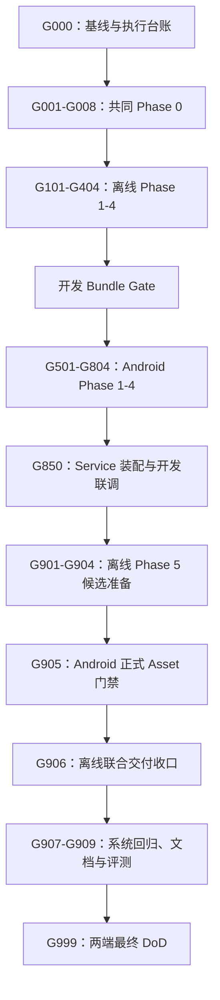

# 车辆知识 RAG 全系统 Goal 开发调度文档

> 文档性质：跨计划执行调度层  
> 适用执行者：一个使用 Goal 模式持续实施的子 Agent  
> 调度范围：离线构建端、共享 Schema、Android AIAgent 端及两端联合验收  
> 不适用范围：重新定义总体架构、替代详细 Task 实现说明、绕过人工审批或发布门禁

> V2 覆盖说明（2026-07-24）：本调度文件的既有 Goal 已完成或仅作为历史追溯。RAG Parent-Child 分块、Parent Evidence 与 Eval V2 后续工作严格改按 `docs/plan_overall/eval/08-rag-parent-child-retrieval-eval-v2-implementation-plan.md` 的 `RAG-EV2-Gxxx` 顺序；不得将旧调度中的 Child Evidence 规则与 V2 混用。

---

## 1. 文档目的

本文件只解决一个问题：**以什么顺序调用两份详细实施计划中的 Task，何时从离线端切换到 Android 端，以及通过什么门禁后才能继续。**

实际执行时必须同时阅读以下三份上位文档：

1. [车辆知识 RAG 总体设计](./vehicle_agent_rag_design.md)：定义架构、协议、安全边界和跨端不变量。
2. [Android 端详细实施计划](./vehicle_agent_android_rag_plan.md)：定义 Android 各 Task 的文件、实现方式、测试与验收。
3. [离线构建端详细实施计划](./vehicle_agent_offline_rag_plan.md)：定义 CLI、Parser、Index、ObjectBox Bundle 和发布流程。

本文件不重复上述文档的文件级实现细节。子 Agent 执行某个调度 Goal 时，必须回到对应详细计划，完整执行被引用 Task 的全部要求。

---

## 2. 文档权威关系

四类信息的权威边界如下：

| 信息类型 | 权威来源 |
|---|---|
| 架构、协议、V1 边界、安全不变量 | 总体设计文档 |
| 跨端先后顺序、Goal 切换、共享产物交接 | 本调度文档 |
| 文件创建/修改、实现步骤、Task 测试与验收 | 对应端详细实施计划 |
| 当前类名、构造关系、可用命令和实际行为 | 当前源码与可重复测试结果 |

出现冲突时不得自行选择一个版本继续实现：

1. 如果是调度顺序冲突，以本文件为准；
2. 如果是技术协议冲突，以总体设计为准；
3. 如果总体设计与当前已批准计划仍无法兼容，暂停当前 Goal，列出冲突位置、影响面和候选方案，询问项目负责人；
4. 不得通过放宽 Scope、Metadata、Citation、Tool Allowlist、Deadline、输入安全或发布门禁来消除冲突。

---

## 3. 已锁定的调度前提

以下内容在执行中不再作为开放设计项：

1. 离线构建端位于当前 Monorepo 的 `tools/rag-indexer/`，但保持独立 Java 17 Gradle Build，不加入 Android 根工程的 `settings.gradle.kts`。
2. 不使用、不读取、不写入原外部空目录 `D:\code\android\AndroidStudioProjects\AIAgent_RAG`。
3. `rag-schema/**` 是两端共享 Schema、Meta Model、协议 Schema 和 Golden 的唯一规范源。
4. 离线端负责 PDF、严格静态 HTML、CommonMark + GFM Table Markdown；Android 运行时不解析原始文档、不生成 Embedding、不重建索引。
5. 离线 CLI 不进入 Android Agent 请求链。
6. `front_camera_interaction` 仅用于车外前向场景，不支持仪表盘或车内视觉。
7. V1 的“知识 + 车控”和“车外视觉 + 知识”复合请求拆成两个请求，不在一个 Agent Request 内串行调用两类能力。
8. 知识请求使用从 Service 接收时刻开始计算的 60 秒端到端绝对 Deadline；各模型和子阶段不能各自重新获得完整 60 秒。
9. 开发 Bundle 和正式发布 Bundle 是两个不同层级的产物。开发 Bundle 可来自受控 Fixture；正式 Bundle 必须通过真实语料校准、CLI Verify、发布状态和跨端门禁。
10. 不允许为了推进计划而伪造许可证结论、目标 ABI 测试、真实评测结果、发布阈值或 `publishable=true`。

---

## 4. 单子 Agent 的 Goal 执行契约

### 4.1 基本规则

- 全程只允许一个活动 Goal，默认严格串行，不启动并行子任务。
- 除本文件明确拆分的两个跨端 Task 外，一个详细计划 Task 对应一个 Goal。
- Goal 只覆盖调度表指定的 Task 和必要验证，不顺手重构相邻模块。
- 未经用户明确授权，不自动创建分支、提交、推送或修改凭证、本地机器配置。
- 用户工作区已有修改全部视为需保留内容；每个 Goal 开始前执行 `git status --short`。
- 只有验收项全部满足且证据已记录，才允许将 Goal 标记为完成。
- Phase Gate 失败时不得创建下一 Phase 的 Goal。
- 如果命令、设备或外部资料不可用，必须写“未执行/待提供”，不能写“通过”。
- Goal 的 token budget 仅在用户明确指定时设置。

### 4.2 每个 Goal 的固定动作

每个 Goal 严格执行以下顺序：

1. 读取本文件对应调度行、总体设计、对应详细 Task、上游产物和目标源码。
2. 检查 `git status --short`，确认本 Goal 文件边界和已有用户改动。
3. 在工作更新中说明现状、依赖、预设前提和本轮验收标准。
4. 实现 Task 的最小完整闭环，新增代码注释统一使用详尽中文说明设计原因。
5. 先运行定向测试，再运行该 Task 或 Phase 要求的回归命令。
6. 复核安全、隐私、资源释放、绝对路径泄漏、确定性和跨端协议影响。
7. 更新执行台账，记录产物、命令、结果、未执行项和风险。
8. 验收全部满足后关闭当前 Goal，再创建调度表中的下一个 Goal。

若当前 Goal 需要用户输入，应保持当前 Goal 的真实状态并询问，不得先标记完成再绕行后续任务。只有满足 Goal 工具当时的 `blocked` 判定规则时才标记阻塞；不能因为第一次等待外部输入就宣称任务已阻塞。

### 4.3 两个跨端 Task 的拆分例外

两个 Task 自身包含“先由离线端生产、再由 Android 验证、最后回到离线端收口”的闭环，无法在一个严格串行 Goal 中直接跨越多个中间 Task，因此调度层允许拆分：

| 详细 Task | 调度拆分 | 完成语义 |
|---|---|---|
| 离线 Task 0.4 | `RAG-G004` 生产 Fixture；`RAG-G008` 联合收口 | `G004` 完成不代表 Task 0.4 完成；只有 `G008` 通过才算完成 |
| 离线 Task 5.4 | `RAG-G904` 准备正式候选；`RAG-G906` 联合收口 | `G904` 只产生待验收候选；只有 `G906` 通过才算完成 |

拆分后的每个 Goal 仍必须拥有独立、可验证、可关闭的目标，禁止留下无法判断状态的“半个 Goal”。

---

## 5. 执行台账与恢复点

`RAG-G000` 应创建：

```text
docs/plan_overall/rag/rag_execution_status.md
```

台账至少包含以下字段：

| 字段 | 含义 |
|---|---|
| Schedule Goal | 本文件中的 `RAG-Gxxx` |
| Source Task | Android/离线详细计划 Task 编号 |
| Status | `NOT_STARTED / IN_PROGRESS / PRODUCER_READY / COMPLETED / WAITING_INPUT / FAILED_GATE` |
| Started / Finished | 实际时间，不填写预计完成时间冒充结果 |
| Changed Files | 本 Goal 实际修改文件 |
| Verification | 命令及通过、失败、未执行状态 |
| Artifacts | Schema、Fixture、Bundle、报告等路径及必要 Hash |
| Decisions | 经用户确认的依赖、阈值和边界 |
| Risks / Next | 遗留风险及唯一下一 Goal |

台账用于跨上下文恢复，不替代测试报告，也不替代 Goal 工具状态。恢复执行时必须定位第一条非 `COMPLETED` 调度项，并重新检查其上游 Gate 是否仍有效。

---

## 6. 总体调度路径



硬顺序为：

```text
共同 Phase 0
  → 离线 Phase 1 → 2 → 3 → 4
  → Android Phase 1 → 2 → 3 → 4
  → Android Service 开发联调
  → 离线 Phase 5 候选
  → Android 正式 Asset 验证
  → 两端最终回归、评测与文档
```

---

## 7. 逐 Goal 调度表

### 7.1 调度初始化

| Goal | 来源 | 目标与动作 | 完成条件 |
|---|---|---|---|
| `RAG-G000` | 调度专用 | 阅读三份上位文档；检查仓库现状；创建执行台账；记录 Android 基线测试、现有目录、外部输入和设备可用性；确认外部空目录不在范围内 | 台账可恢复；已记录许可证审批人、DashScope 环境、真实语料、目标 ABI 设备四类输入的当前状态；基线失败与本次新增失败可区分 |

`RAG-G000` 只建立事实基线，不提前修改依赖、Schema 或业务代码。发现详细计划引用的现有类名已经变化时，在台账记录映射；只有形成协议冲突时才暂停询问。

### 7.2 共同 Phase 0：工程、许可证、Schema 与最小跨端兼容

| Goal | 来源 Task | 主要目标 | 输入 | 输出与 Gate |
|---|---|---|---|---|
| `RAG-G001` | 离线 0.1 | 创建 `tools/rag-indexer` 独立 Java 17 Gradle CLI 骨架，证明不污染 Android 根构建 | G000 基线 | CLI 最小 Build/Help/测试通过；Android `settings.gradle.kts` 未包含 CLI |
| `RAG-G002` | 离线 0.2 | 完成依赖树、许可证、商业发布、安全和 Parser 共存审查，首建共同兼容报告 | G001 | `rag_dependency_compatibility_gate.md` 与许可证报告；关键法律结论未确认则停止 |
| `RAG-G003` | 离线 0.3 | 创建并锁定 `rag-schema` 唯一规范源、Meta Model、Manifest Schema 与共享 Golden | G002 已允许接入依赖 | Schema Hash/UID/物化同步保护测试通过；离线端成为唯一事实负责人 |
| `RAG-G004` | 离线 0.4-A | 使用共享 Schema 生成最小 ObjectBox 跨端 Fixture 和生成报告；完成离线写入、自检部分 | G003 | `rag-schema/test-fixtures/objectbox-v1/` 可重复生成；台账记 `PRODUCER_READY`，不得宣称 Task 0.4 完成 |
| `RAG-G005` | Android 0.1 | 补充 Android 依赖、许可证和发布审查信息，不重复创建兼容报告 | G002、G003 | Android 依赖候选与共同版本约束有证据；法律结论一致 |
| `RAG-G006` | Android 0.2 | 消费共享 Schema/Meta Model/Fixture，创建 generated test asset 路径并执行最小打开、Dense、Lexical、Scope、Locator 验证 | G004、G005 | Android 不维护第二份 Fixture；正反兼容用例通过或有明确失败证据 |
| `RAG-G007` | Android 0.3 | 锁定 ObjectBox 版本、Schema 消费方式、生成代码、R8、ABI、APK/AAB 和测试/正式 Asset 隔离策略 | G006 | Android 单测、构建、目标 ABI Instrumentation、原生库打包检查达到详细计划要求 |
| `RAG-G008` | 离线 0.4-B + 共同 Gate | 汇总 Android 结果，补齐共同兼容报告；确认同一 Schema、UID、ObjectBox/HNSW 配置可跨端使用 | G007 | 两端 Phase 0 全部门禁通过；兼容报告无未决关键项；离线 Task 0.4 此时才标记完成 |

`RAG-G008` 是第一道硬停止点。许可证、目标 ABI、共享 Meta Model 或最小数据库打开任一未通过，禁止进入离线 Phase 1。

### 7.3 离线 Phase 1：CLI 输入、配置与统一协议

| Goal | 来源 Task | 主要目标 | 完成条件 |
|---|---|---|---|
| `RAG-G101` | 离线 1.1 | 实现 `validate/build/verify/evaluate` 命令骨架、退出码、取消和运行上下文 | 定向 CLI 测试通过；敏感参数不进入日志 |
| `RAG-G102` | 离线 1.2 | 定义并严格校验 `corpus.json`、`rag-build.json`、Hash、Scope 与未知字段 | 正反例、版本和确定性测试通过 |
| `RAG-G103` | 离线 1.3 | 实现 Corpus Root、安全路径、符号链接、格式探测、Charset 和资源上限 | 路径逃逸、URL、伪装格式和 Charset 冲突测试通过 |
| `RAG-G104` | 离线 1.4 | 实现统一领域模型、诊断、SourceLocator 和 Parser Registry，并执行离线 Phase 1 Gate | `test check installDist` 及详细计划 Phase 1 用例通过 |

### 7.4 离线 Phase 2：三种静态文档解析

| Goal | 来源 Task | 主要目标 | 完成条件 |
|---|---|---|---|
| `RAG-G201` | 离线 2.1 | 实现 PDF 分类、逐页字形提取、阅读顺序和不支持路径 | 文本型 PDF 可追踪；扫描、需要密码或禁止内容提取的加密 PDF、损坏及未审核 MIXED 按协议失败；允许内容提取的无密码 PDF 只读解析 |
| `RAG-G202` | 离线 2.2 | 实现 PDF 文本型表格、跨页表格、Warning 与 Locator | 表格自包含、跨页与 Warning 测试通过；不引入 OCR |
| `RAG-G203` | 离线 2.3 | 实现严格静态 HTML Parser 和资源/复杂度边界 | 不联网、不执行脚本、不读取外部资源；动态正文不被静默接受 |
| `RAG-G204` | 离线 2.4 | 实现 CommonMark + GFM Table Markdown Parser | 标题、表格、代码块、Locator 和不支持扩展诊断通过 |
| `RAG-G205` | 离线 2.5 | 统一解析质量、跨格式结构和 Locator 连续性校验，并执行离线 Phase 2 Gate | 三格式输出统一模型；`validate` 与 `test check` 通过 |

### 7.5 离线 Phase 3：Chunk、Embedding 与 Lexical Index

| Goal | 来源 Task | 主要目标 | 完成条件 |
|---|---|---|---|
| `RAG-G301` | 离线 3.1 | 实现 Heading-aware Parent/Child Chunk、表格和 Warning 原子边界 | Chunk 预算、Locator、表格自包含和父子引用测试通过 |
| `RAG-G302` | 离线 3.2 | 实现稳定 ID、Embedding 输入模板、排序与重建指纹 | 同输入同配置结果稳定；共享 Embedding Golden 通过 |
| `RAG-G303` | 离线 3.3 | 实现 DashScope 文档 Embedding、批处理、重试、取消、缓存恢复与响应索引校验 | Mock 与获准真实接口验证通过；1024 维和数值完整性受硬校验 |
| `RAG-G304` | 离线 3.4 | 实现跨端一致 Analyzer、postings、df/tf/avgdl 与共享 Golden，并执行离线 Phase 3 Gate | CLI Golden 通过并可供 Android 消费；`test check` 通过；缺向量不可发布 |

### 7.6 离线 Phase 4：开发 Bundle

| Goal | 来源 Task | 主要目标 | 完成条件 |
|---|---|---|---|
| `RAG-G401` | 离线 4.1 | 实现领域模型到共享 ObjectBox Entity 的严格映射 | Scope、Metadata、Parent/Child、Locator 和向量映射测试通过 |
| `RAG-G402` | 离线 4.2 | 实现确定性 ObjectBox Writer、写入顺序和 Store 自检 | Store 计数/引用/向量/postings 一致，关闭后再计算 Hash |
| `RAG-G403` | 离线 4.3 | 生成稳定 Manifest、Store Metadata 与 Build Report | 三者版本、Hash、Scope、计数一致；报告无敏感信息和绝对路径 |
| `RAG-G404` | 离线 4.4 | 串起 Build/Validate/Verify Pipeline、Checkpoint、同 FileStore staging 和原子输出；生成开发 Bundle | 离线 Phase 4 Gate 通过；开发 Bundle 仅作为联调候选，保留构建命令与 Hash |

开发 Bundle 必须满足以下交接条件：

- 包含同次构建的 `data.mdb`、`manifest.json`、`build-report.json`；
- CLI `verify` 通过；
- Schema、HNSW、Analyzer、Parser、Chunk、Embedding 指纹完整；
- 其是否来自 Fixture、是否可正式发布必须明确标记；
- Android 开发联调只消费 `data.mdb` 和 `manifest.json`，不得把 `build-report.json` 打入 APK；
- 在正式候选前，不得覆盖 `app/src/main/assets/rag/knowledge_db/` 的发布内容。

### 7.7 Android Phase 1：协议、VehicleProfile 与 Store 生命周期

| Goal | 来源 Task | 主要目标 | 完成条件 |
|---|---|---|---|
| `RAG-G501` | Android 1.1 | 实现跨层领域模型、序列化和稳定错误协议 | model/JSON 正反例和 API 兼容测试通过 |
| `RAG-G502` | Android 1.2 | 扩展可信 VehicleProfile、Knowledge Scope 解析和缺失策略 | Profile 只来自可信 Provider；通配、缺失和不匹配测试通过 |
| `RAG-G503` | Android 1.3 | 实现 Manifest/Store Metadata 兼容校验与 Store 状态机 | `UNINITIALIZED/INSTALLING/READY/FAILED/CLOSED` 迁移及旧 Store 保持策略通过 |
| `RAG-G504` | Android 1.4 | 实现 Asset 流式安装、版本目录、原子切换、回滚和崩溃恢复，并执行 Android Phase 1 Gate | shared/generated Fixture Instrumentation 与单测、构建通过；无 main Asset 时非知识 Service 可启动 |

### 7.8 Android Phase 2：Hybrid Retrieval 与 Evidence

| Goal | 来源 Task | 主要目标 | 完成条件 |
|---|---|---|---|
| `RAG-G601` | Android 2.1 | 集中 RAG 配置、Query 规范化和与 CLI 一致的 Lexical Analyzer | Android 运行共享 Analyzer Golden，无协议漂移 |
| `RAG-G602` | Android 2.2 | 实现 Profile/Scope/Metadata 资格过滤、Dense、BM25 和本地查询 | 不合格候选在 RRF/Rerank 前被排除；开发 Bundle 查询通过 |
| `RAG-G603` | Android 2.3 | 实现共享绝对 Deadline 下可取消的 Query Embedding 与 Rerank Client | 请求/响应索引、取消、预算、降级和隐私测试通过 |
| `RAG-G604` | Android 2.4 | 实现 RRF、Evidence 去重/预算、Answerability 与 SourceLocator 映射 | Dense/Hybrid/两种降级/无证据用例通过 |
| `RAG-G605` | Android 2.5 | 实现 VehicleKnowledgeService、结果映射与检索编排，并执行 Android Phase 2 Gate | 完整 RAG 单测、MockWebServer、开发 Bundle、构建及隐私检查通过 |

### 7.9 Android Phase 3：路由、请求状态、Tool 与授权

本阶段按真实依赖把详细计划 Task 3.3 调度到 Task 3.2 之前：Tool 入口需要通过 `RequestExecutionContext` 获得同一个请求级 `KnowledgeRequestState`，先建立该状态桥接可以避免 Tool 临时引入全局 Map 或重复计数器。

| Goal | 来源 Task | 主要目标 | 完成条件 |
|---|---|---|---|
| `RAG-G701` | Android 3.1 | 实现 KnowledgeNeedDetector、NONE/REQUIRED 路由与两类复合请求拆分 | 不输出 OPTIONAL；车内/仪表盘不误用前向视觉；复合请求不执行 Tool |
| `RAG-G702` | Android 3.3 | 实现请求私有 Knowledge State、同实例执行上下文桥接、60 秒绝对 Deadline 和取消注册 | 单迭代一次、单请求两次、Query 去重、Evidence ID 复用/递增、finally 清理通过 |
| `RAG-G703` | Android 3.2 | 新增 Knowledge ToolGroup 和唯一 `searchVehicleKnowledge` Tool | Tool 只从执行上下文取状态；上下文缺失时 fail closed；不创建第二份状态存储 |
| `RAG-G704` | Android 3.4 | 为全部 TEXT Tool 建立 Allowlist、Knowledge Batch Policy 与 Dispatch 前授权，并执行 Android Phase 3 Gate | REQUIRED 只暴露知识 Tool；隐藏/混合/未授权批次无副作用；单测和构建通过 |

### 7.10 Android Phase 4：强制 ToolLoop、Memory、Citation 与 Trace

| Goal | 来源 Task | 主要目标 | 完成条件 |
|---|---|---|---|
| `RAG-G801` | Android 4.1 | 实现 REQUIRED 必须查证、一次受控重试、最多两次不同 Query 和所有终态协议 | 模型不调用 Tool、重复 Query、无证据、超时、取消均闭环 |
| `RAG-G802` | Android 4.2 | 实现请求内完整 KnowledgeTurnBuffer 与 Session 紧凑投影；抑制 REQUIRED 的长期记忆提取 | 当前请求证据完整；持久化不膨胀；消息序列合法；新请求不继承 Citation Map |
| `RAG-G803` | Android 4.3 | 实现 CitationGuard、Grounding Prompt 和三种 SourceLocator 渲染 | REQUIRED 成功至少一个有效引用；未知/缺失引用不可放行 |
| `RAG-G804` | Android 4.4 | 完成 RAG Trace、脱敏、稳定错误映射并执行 Android Phase 4 Gate | 知识、普通聊天、车控、安全、会话、Context、视觉回归通过；单测、构建、Lint 通过 |

### 7.11 Android Service 开发联调

| Goal | 来源 Task | 主要目标 | 完成条件 |
|---|---|---|---|
| `RAG-G850` | Android 5.1 | 在 AIAgentService 完成生产依赖装配、异步 Store 初始化、请求状态绑定、取消和释放；使用开发 Bundle 做联调 | 非知识能力不依赖 RAG READY；知识全链路可运行；Service 生命周期、关闭顺序和开发 Bundle 联调用例通过 |

`RAG-G850` 完成后只表示 **Android 代码链路已与开发 Bundle 打通**，不表示正式 Asset、真实阈值或整个 RAG 系统已经发布就绪。

### 7.12 离线 Phase 5 与正式候选准备

| Goal | 来源 Task | 主要目标 | 完成条件 |
|---|---|---|---|
| `RAG-G901` | 离线 5.1 | 建立可审计 PDF/静态 HTML/Markdown Fixture、Golden 和更新工具 | 合成/授权来源、预期结果和 Golden 变更原因可追踪 |
| `RAG-G902` | 离线 5.2 | 补齐 CLI 全链路、安全、确定性、取消、中断和故障注入测试 | 详细计划用例矩阵与 `clean test check installDist distZip` 达到要求 |
| `RAG-G903` | 离线 5.3 | 使用获准真实文档校准 Parser、Chunk、HNSW 和离线 Dense 指标；将发布参数从 TEST_ONLY 提升为 APPROVED | 真实资料授权、Metadata 审核、评测集和报告齐全；不以离线 Dense 替代 Android Hybrid/回答评测 |
| `RAG-G904` | 离线 5.4-A | 使用 APPROVED 配置构建正式 Bundle 候选，执行 CLI Verify，确认 `publishable=true`，准备交付记录草稿 | 三个同次构建产物及 Hash 已冻结；候选放在审计/交接位置，尚未写入 Android main Assets；状态记 `PRODUCER_READY` |

真实资料、DashScope 凭证或人工批准阈值尚未具备时，`RAG-G903`/`G904` 必须停在真实状态。可以报告“实现完成，正式候选待输入”，不得用 Fixture 伪装正式候选。

### 7.13 正式 Bundle 跨端交接与最终收口

| Goal | 来源 Task | 主要目标 | 完成条件 |
|---|---|---|---|
| `RAG-G905` | Android 5.2 | 验证候选 DB/Manifest 同源，执行 Hash、Schema、Scope、HNSW、Analyzer、格式、目标 ABI、安装/升级/回滚、资源和 `noCompress` 对比；通过后才复制正式 Asset | PDF/HTML/Markdown、Dense/Lexical/Metadata、坏包拒绝与目标 ABI 通过；`build-report.json` 未进入 APK |
| `RAG-G906` | 离线 5.4-B | 汇总 G905 证据，完成跨运行时兼容报告和 Bundle 交付记录 | 离线 Task 5.4 完成；构建命令、版本、配置/Corpus/Bundle Hash、目标 ABI 结果可审计 |
| `RAG-G907` | Android 5.3 | 建立并执行知识、普通聊天、车控、安全确认、前向视觉、复合请求、取消、超时、引用与降级端到端回归 | Android E2E 和必要 Instrumentation 通过；无能力回归和消息序列破坏 |
| `RAG-G908` | 离线 5.5 | 完善 CLI 使用、输入安全、命令、输出、重建、Golden、跨端门禁和维护文档；先写离线与共同交付内容 | CLI README/设计与真实命令一致；根 README 中离线边界准确，等待 Android 最终统一复核 |
| `RAG-G909` | Android 5.4 | 完成 Android Hybrid/No-Evidence/Citation/Faithfulness/延迟/资源评测，锁定阈值与预算；按 README 现有章节脉络完成全系统最终更新 | Android Phase 5 Gate 全部通过；评测数据支持 APPROVED；README、设计、报告与最终代码一致 |

`RAG-G908` 与 `RAG-G909` 均会涉及根 README，但必须串行：`G908` 先补离线构建与 Bundle 交付内容，`G909` 作为根 README 的最终整合者，复核并保留离线内容，再补 Android Runtime、ToolLoop、Deadline、降级和 V1 限制。

### 7.14 最终联合 Gate

| Goal | 来源 | 主要目标 | 完成条件 |
|---|---|---|---|
| `RAG-G999` | 两份计划 DoD | 从干净可复现状态运行两端最终命令，逐项核对总体设计不变量、两份计划 Definition of Done、产物边界和报告完整性 | 所有可执行项通过；所有外部批准有记录；执行台账无 `IN_PROGRESS/PRODUCER_READY/FAILED_GATE`；输出最终交付总结 |

建议的最终基础命令如下，定向测试和目标 ABI 命令仍以详细计划为准：

```powershell
# 离线构建端
cd tools\rag-indexer
.\gradlew.bat clean test check installDist distZip

# Android 端
cd ..\..
.\gradlew.bat testDebugUnitTest
.\gradlew.bat assembleDebug
.\gradlew.bat lintDebug
.\gradlew.bat connectedDebugAndroidTest
```

如果目标 ABI 设备、真实语料或正式授权缺失，`RAG-G999` 只能输出明确的部分完成状态，不得关闭为“整个 RAG 系统已交付”。

---

## 8. 跨端交接清单

### 8.1 共同 Phase 0 交接

离线端向 Android 端交付：

- `rag-schema/**`；
- 稳定 Meta Model 与 UID；
- Manifest JSON Schema 与共享 Golden；
- 最小 ObjectBox Fixture；
- Fixture 生成命令、版本和指纹；
- 共同依赖/许可证报告的离线部分。

Android 端回填：

- 共享源码/物化 Schema 的实际消费方式；
- `MyObjectBox` 生成和 Hash 校验结果；
- ObjectBox 打开、Dense/Lexical/Scope/Locator 结果；
- 目标 ABI 原生库加载与 APK/AAB 打包结果；
- 错误 Schema/HNSW/Scope 拒绝结果。

### 8.2 开发 Bundle 交接

开发 Bundle 由离线 `RAG-G404` 产生，由 Android `RAG-G601-G850` 消费。交接必须记录：

- Bundle 路径、版本、DB Hash、Manifest Hash；
- `fixture/test-only` 标识；
- Schema/HNSW/Analyzer/Parser/Chunk/Embedding 指纹；
- CLI Verify 结果；
- Android 消费方式，优先使用 generated test assets 或明确的开发注入路径。

开发 Bundle 不具备正式发布资格，不能因为 Android 查询成功而改写为 APPROVED。

### 8.3 正式 Bundle 交接

正式候选由离线 `RAG-G904` 冻结，由 Android `RAG-G905` 验证，最后由离线 `RAG-G906` 完成交付记录。必须满足：

1. `data.mdb`、`manifest.json`、`build-report.json` 来自同一次构建；
2. `build-report.publishable=true`，发布参数均为 APPROVED；
3. Android main Assets 只接收 `data.mdb` 与 `manifest.json`；
4. `build-report.json` 只保留在审计目录；
5. 未通过 Android 门禁的候选不得进入 main Assets；
6. 不能直接覆盖旧输出或旧发布 Asset，切换和回滚按详细计划执行；
7. 所有 Hash、命令、版本、Corpus 版本和测试环境进入交付记录。

---

## 9. Gate 失败和回退规则

### 9.1 不允许继续的硬失败

出现以下任一情况，停止当前 Goal 并询问项目负责人：

- ObjectBox 许可证、商业发布、Vector Search 或依赖再分发条件不明确；
- 两端不能使用同一 Meta Model 打开同一 Store；
- 目标 ABI 缺少原生库或正式数据库无法作为已定义 Bundle 交付；
- DashScope 实际接口不满足 1024 维、取消、响应索引或数据边界；
- 真实资料不允许进入云 Embedding、Fixture、仓库或 APK；
- 静态 HTML 无脚本时没有正文，但业务仍要求支持；
- PDF 必须依靠 OCR/商业 SDK 才能达到要求；
- 需要改变共享 Entity、SourceLocator、Manifest、Scope、Analyzer 或 HNSW 协议；
- 正式 Asset 体积、复制峰值空间或启动开销超过尚未批准的预算；
- 评测不足以锁定阈值，却被要求标记 APPROVED 或正式启用。

### 9.2 变更影响与回退起点

| 变更类型 | 必须回退到的最早 Goal | 必须重新执行 |
|---|---|---|
| Entity 字段、UID、Meta Model、ObjectBox/HNSW | `RAG-G003` | 共享 Schema、Fixture、共同 Phase 0、所有 Bundle 和 Android 兼容门禁 |
| Manifest、Scope、SourceLocator、兼容 Fingerprint | `RAG-G003` | 共享 Golden、离线映射/Bundle、Android校验与引用测试 |
| Embedding 输入、模型、维度 | `RAG-G302`；维度变化还需回到 `G003` | Embedding Cache 失效、全量向量、Bundle、Android检索与评测 |
| Analyzer 规则 | `RAG-G304` | Golden、postings、Bundle、Android Analyzer/BM25 与评测 |
| Parser 或 Chunk 规则 | 对应 `RAG-G201-G205` 或 `RAG-G301` | 下游 Chunk/Embedding/Index/Bundle 及跨端评测 |
| Android Tool/Deadline/Memory/Citation | 对应 `RAG-G701-G804` | 受影响 Phase Gate、E2E、Android 评测；无需无条件重建 DB |
| 仅文档措辞且不改变协议 | 当前文档 Goal | 文档一致性检查，不触发数据重建 |

回退不等于删除已有产物。保留旧版本和失败证据，创建新版本目录或新构建输出，禁止手工修改 `data.mdb` 修补问题。

---

## 10. 外部输入与人工审批检查点

| 检查点 | 最迟需要时间 | 未具备时的处理 |
|---|---|---|
| 依赖许可证与商业发布确认 | `RAG-G002` | 停止共同 Phase 0 |
| ObjectBox 目标 ABI 设备或等效验证环境 | `RAG-G006-G008` | 不能宣布共同 Phase 0 完成 |
| DashScope API/凭证和数据发送授权 | `RAG-G303` | 可完成 Mock 代码，但不得通过真实接口/Phase Gate |
| 官方 PDF/静态 HTML/Markdown、使用授权和 Metadata | `RAG-G903` | 保持 Fixture 实现状态，不生成正式候选 |
| APK 体积、安装空间、延迟和回答质量目标 | `RAG-G905-G909` | 报告实测值并询问，不能自行设为 APPROVED |
| 发布负责人对最终阈值和候选的确认 | `RAG-G909-G999` | 可给出候选报告，不能宣称发布完成 |

所有凭证通过既有安全渠道或环境变量提供，不写入计划、源码、Manifest、Report、Trace、日志或执行台账。

---

## 11. 中断后的恢复流程

子 Agent 因上下文压缩、用户暂停或外部环境中断后，按以下顺序恢复：

1. 读取本文件和 `rag_execution_status.md`。
2. 执行 `git status --short`，确认中断期间是否出现新改动。
3. 找到第一条非 `COMPLETED` 调度 Goal；如果是 `PRODUCER_READY`，转到本文件规定的消费 Goal，而不是重新生成产物。
4. 校验上游关键产物仍存在，必要时重算 Schema/Fixture/Bundle Hash。
5. 如果上游代码或协议在 Gate 后发生变化，按第 9.2 节回退并重跑受影响 Gate。
6. 恢复当前 Goal，先运行最小定向测试确认工作区状态，再继续实现。
7. 不因台账写着“通过”而跳过已失效的测试证据。

---

## 12. 最终交付状态定义

最终总结只能使用以下三种状态之一：

### 12.1 `RAG_SYSTEM_COMPLETE`

仅当 `RAG-G999` 全部通过，且两份详细计划 Definition of Done、真实评测、目标 ABI、正式 Bundle 和人工审批均完成时使用。

### 12.2 `IMPLEMENTATION_COMPLETE_RELEASE_GATE_PENDING`

代码、Fixture、开发 Bundle、单元测试和可用环境中的集成测试已完成，但真实资料、目标 ABI、发布阈值、许可证签署或正式候选中的任一外部门禁尚未完成时使用。必须逐条列出未完成项。

### 12.3 `PARTIAL_IMPLEMENTATION`

仍有调度 Goal 未实现、测试失败或协议问题未解决时使用。必须报告最后完成的 Goal、当前 Goal、阻塞证据和恢复入口。

不得使用“基本完成”“应该可用”等无法审计的模糊状态替代上述定义。

---

## 13. 每个 Goal 的交付汇报模板

子 Agent 每次关闭 Goal 时使用以下结构：

```markdown
## Goal

- Schedule Goal：RAG-Gxxx
- Source Task：Android/离线 Task x.x
- 目标：...

## 修改内容与逻辑

- 文件：...
- 设计与实现：...
- 保留的既有行为：...

## 验证

- 命令：...
- 结果：通过 / 失败 / 未执行
- 证据或报告：...

## Gate 与下一步

- 当前 Gate：通过 / 未通过 / 等待输入
- 遗留风险：...
- 唯一下一 Goal：RAG-Gxxx
```

Phase 最后一个 Goal 还必须单独列出该 Phase Gate 的每条验收项，不得只写“测试通过”。

---

## 14. 给执行子 Agent 的启动指令

收到本文件后，执行子 Agent 应从 `RAG-G000` 开始，不直接跳到编码：

1. 完整阅读总体设计、本调度文档和两份详细计划；
2. 创建一个目标明确的 `RAG-G000` Goal，不把整个 RAG 项目放进一个超大 Goal；
3. 按调度表逐个创建、实施和关闭 Goal；
4. 每次只以对应详细 Task 作为实现边界；
5. 在 Gate、共享协议或外部批准不明确时停在当前 Goal 并询问；
6. 持续维护执行台账，使任务可从任意中断点恢复；
7. 只有 `RAG-G999` 满足完整条件后，才能宣布整个 RAG 系统完成。
